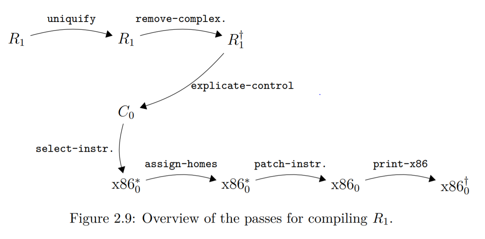

# Rust One Piece | R1 (二)

上一篇，我们完成了 R1 的解释器，接下来的几篇都是关于 R1 编译器的。

### 编译之旅



以上即是从 R1 编译到汇编的过程。可以看到有 7 个 pass。

+ uniquify 的功能是修改变量名，通常称为 name mangle，把变量名变成全宇宙唯一的，这样就可以避免命名冲突。之所以需要这样做，是因为底层的汇编并不存在局部作用域。详细的解说可参考 EOC 2.3 节。
+ remove-complex. 是 remove_complex_opera 的缩写。字面意思是把复杂的操作移除。书中的例子：

```lisp
(+ 52 (- 10))           =>              (let ([tmp.1 (- 10)])
                                            (+ 52 tmp.1))
```

也就是说，把复杂式子的中间结果用变量缓存起来。

+ explicate-control 这一个 pass 把 let 结构解开了，所以局部作用域消失了，这也是为什么 uniquify 要放在它前面的原因。这一 pass 将 R1 转换成了 C0。

```lisp
(let ([y (let ([x.1 20])                                            locals: y x.1 x.2
            (let ([x.2 22])                       =>                start: 
                (+ x.1 x.2)))])                                         x.1 = 20;
    y)                                                                  x.2 = 22;
                                                                        y = (+ x.1 x.2);
                                                                        return y;
```

+ select-instructions 将 C0 转换成接近汇编的格式 x86_0 ，这一步是选择指令。

```lisp
x = (+ 10 32);                  =>                                  movq $10, x
                                                                    addq $32, x
```

+ assign-homes 将变量映射到寄存器或者内存上，在这一节只映射到内存，EOC 第三章会学习一个寄存器分配的算法。

```asm
locals: a b                                                 stack-space: 16
start:                                                      start:
movq $42, a                     =>                          movq $42, -8(%rbp)
movq a, b                                                   movq -8(%rbp), -16(%rbp)
movq b, %rax                                                movq -16(%rbp), %rax
jmp conclusion                                              jmp conclusion 
```

+ patch-instructions 是一个补丁，将修复前面 pass 的一些问题。如在上一个 pass 中，允许内存与内存之间的操作，这一个 pass 将修复这样的操作。因为实际上 intel 的 x86-64 不存在这样的指令。

```
movq -8(%rbp), -16(%rbp)        =>                          movq -8(%rbp), %rax,
                                                            movq %rax, -16(%rbp)
```

+ print-x86 这个 pass 输出 x86 指令，是最后一步。

这一篇博客中我们先写前两个 pass。

### uniquify

这个 pass 的目标是把变量名变成全局唯一的。我使用 uuid 这个 crate 来完成。在 Cargo.toml 中添加以下依赖。

```toml
[dependencies]
uuid = { version = "0.8", features = ["serde", "v4"] }
```

然后，在`helper.rs`中定义以下函数

```rs
pub fn gensym() -> String {
    use uuid::Uuid;
    return Uuid::new_v4().to_string();
}
```

gensym 是生成符号的意思，这是 Racket 的一个内置函数，我们取一个相同的名字！

现在，我们已经有能力生成一个在三千大千世界都唯一的标识符了！接下来要替换诸如 a, b 这样的变量，我们遵循以下做法：

+ 新建一个符号表，用于保存原变量名与新变量名的对应关系
+ 遇到 let，则给那个变量换个名字，并保存到符号表中
+ 遇到 Var，则用符号表中的新变量名进行替换
+ 遇到其他表示式，则递归求解其中的表达式

细心的读者可能发现了，这个跟 R1 解释器的模式一模一样。

```rs
// compiler.rs
use std::rc::Rc;
pub fn uniquify(expr: Expr) -> Expr {
    let symtable = Rc::new(SymTable::new());        // 初始化符号表
    return uniquify_expr(expr, symtable);
}

fn uniquify_expr(expr: Expr, symtable: Rc<SymTable<String, String>>) -> Expr {
    match expr {
        Var(x) => Var(symtable.lookup(&x).to_string()),     // 遇到变量，则查表中的新名字
        Int(n) => Int(n),
        Let(box Var(x), box e, box body) => {
            let new_x = gensym();                           // 生成一个新名字
            let new_symtable: SymTable<String, String> = SymTable::extend(hashmap!(x => new_x.clone()), &symtable);
            let new_e = Box::new(uniquify_expr(e, symtable));
            let new_body = Box::new(uniquify_expr(body, Rc::new(new_symtable)));
            return Let (Box::new(Var(new_x)), new_e, new_body);     // 用新名字重新生成 let
        },
        Prim0(op) => Prim0(op),
        Prim1(op, box e1) => Prim1(op, Box::new( uniquify_expr(e1, symtable))),
        Prim2(op, box e1, box e2) => Prim2(op, Box::new(uniquify_expr(e1, Rc::clone(&symtable))), 
                                               Box::new(uniquify_expr(e2, symtable))),
        _ => panic!("should not reach!"),
    }
}
```

测试一下

```rs
#[test]
fn test_uniquify() {
    let e = "(let (x (let (x 4) 
                    (+ x 1)))
            (+ x 2))";
    let exp = parse(e);
    let exp = uniquify(exp);
    if let Let(box Var(x1), box Let(box Var(x2), _i1, box Prim2(_add, box Var(x2_), box _i2)), box Prim2(_add1, box Var(x1_), box _i3)) = &exp {
        assert_eq!(x1, x1_);
        assert_eq!(x2, x2_);
        assert_ne!(x1, x2);
    } else {
        panic!("uniquify fails!");
    }
    let res = interp_r1(exp);
    assert_eq!(res, 7);
}
```
`uniquify` 这个 pass 并没有影响表达式的结果，所以我们除了检查变量名之外，还可以检查它的结果。

### remove-complex-opera

这个 pass 是通过引入中间变量来移除复杂的计算。主要发生在 Prim1，Prim2 这两种操作中。具体而言，当这两种操作的参数是 Prim1 或者 Prim2 的时候，就需要引入中间变量，把（参数中的）Prim1 或者 Prim2 的计算结果赋值给这个中间变量，以一个 Let 语句进行返回。

```rs
use std::mem;
pub fn remove_complex_opera(expr: Expr) -> Expr {
    match expr {
        Var(x) => Var(x),
        Int(n) => Int(n),
        Let(box Var(x), box e, box body) => {
            Let ( Box::new(Var(x)), Box::new( remove_complex_opera(e) ), Box::new( remove_complex_opera(body) ))
        },
        Prim0(op) => Prim0(op),
        Prim1(op, box e) => {
            if is_prim1_or_prim2(&e) {
                let x = gensym();
                Let ( Box::new(Var(x.clone())), Box::new(remove_complex_opera(e)), Box::new(Prim1(op, Box::new(Var(x)))))
            } else {
                Prim1(op, Box::new( remove_complex_opera(e) ))
            }
        },
        Prim2(op, box e1, box e2) => {
            if is_prim1_or_prim2(&e1) {
                let x = gensym();
                Let ( Box::new(Var(x.clone())), Box::new(remove_complex_opera(e1)), 
                    Box::new(Prim2(op, Box::new(Var(x)), Box::new(remove_complex_opera(e2)))))
            } else if is_prim1_or_prim2(&e2) {
                let x = gensym();
                Let ( Box::new(Var(x.clone())), Box::new(remove_complex_opera(e2)), 
                    Box::new(Prim2(op, Box::new(remove_complex_opera(e1)), Box::new(Var(x)))))
            } else {
                Prim2(op, Box::new( remove_complex_opera(e1)), Box::new(remove_complex_opera(e2) ))
            }
        },
        _ => panic!("should not reach!"),
    }
}

fn is_prim1_or_prim2(expr: &Expr) -> bool {
    let any_prim1 = Prim1(String::new(), Box::new(Int(1)));
    let any_prim2 = Prim2(String::new(), Box::new(Int(1)), Box::new(Int(1)));
    mem::discriminant(expr) == mem::discriminant(&any_prim1) ||
    mem::discriminant(expr) == mem::discriminant(&any_prim2)
}
```

`mem::discriminant`可以检查`enum`的子类，可是它只能按实例进行检查，所以创建了`any_prim1`和`any_prim2`来帮助完成检查。

测试一下

```rs
#[test]
fn test_remove_complex_opera() {
    let e = "(+ 10 (- 8))";
    let exp = parse(e);
    let exp = remove_complex_opera(exp);
    if let Let(box Var(x), box Prim1(_sub, box Int(n)), box Prim2(_add, box Int(n1), box Var(x1))) = &exp {
        assert_eq!(x, x1);
        assert_eq!(n, &8);
        assert_eq!(n1, &10);
    } else {
        panic!("remove_complex_opera fails!");
    }
    assert_eq!(interp_r1(exp), 2);
}
```

### 结语

这一小节，EOC 阐述了编译到汇编的框架。我们在这里完成了 R1 -> R1 的两个 Pass 。下一节，我们将 R1 编译到 C0，一种类似 C 的语言，所以，学习 EOC 不仅知道如何编译到汇编，还能知道如何编译到 C 呢！