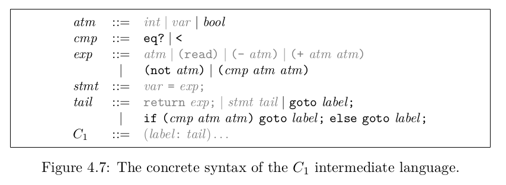
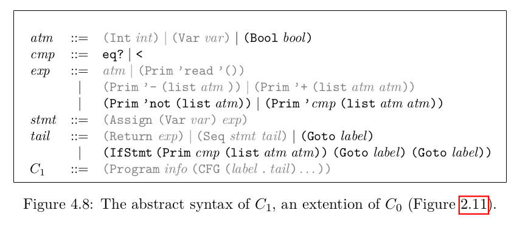

# Rust One Piece | R2（三）

由于 uniquify 和 remove_complex_opera 基本不用改，所以 EoC 并不提及。但是，我之前使用的 gensym 生成的 uuid 会生成带数字前缀的字符串，所以我做了一点小改动。remove_complex_opera 也增加了对 if 语句和 let 语句的处理。这部分比较简单，有需要者可参考代码。

现在，我们来到了 explicate_control 。

### C1 




R2 中的 C0 定义如下（书中是 C1）：

```rs
// C1 -- Just keep C0 because I am lazy
#[derive(Debug, PartialEq, Eq, Clone, Hash)]
pub enum C0 {
    Int(i64),
    Var(String),
    Bool(bool),
    Prim0(String),
    Prim1(String, Box<C0>),
    Prim2(String, Box<C0>, Box<C0>),
    Assign(Box<C0>, Box<C0>),
    Return(Box<C0>),
    Seq(Box<C0>, Box<C0>),
    Goto(String),
    If(Box<C0>, Box<C0>, Box<C0>),
}

#[derive(Debug)]
pub struct C0Program {
    pub locals: HashSet<C0>,
    pub cfg: Vec<(String, C0)>, // control flow 
}
```

C0 部分，我们增加了布尔运算和跳转语句，C0Program 中 locals 变成一个集合。

### explicate_control

在 R1 Plus 版本中，我们已经对 explicate_control 进行了垂构。R1 Plus 有两种上下文：explicate_assign 以及 explicate_tail。这一节，我们增加一个新的上下文，explicate_pred，它处理 if 语句的第一个子表达式。

让我们跟着代码一点一点来分析处理的思路。

首先，仍是对整个表达式调用 explicate_tail。

```rs
use crate::syntax::{C0, C0Program};
pub fn explicate_control(expr: Expr) -> C0Program {
    let mut cfg = vec![];
    let mut locals = HashSet::new();
    let expr = explicate_tail(expr, &mut cfg, &mut locals);
    cfg.push(("start".to_string(), expr));
    C0Program { locals, cfg }
}
```

在 explicate_tail 内部，对 let 语句的处理不变。对于 if 语句。由于这是一个位于 tail 位置的语句，所以它的 then 和 else 语句都应该作为 tail 处理。然后，连同条件一起送入 explicate_pred 函数中。这就是 explicate_tail 该做的全部事情了。

```rs
fn explicate_tail(expr: Expr, cfg: &mut Vec<(String, C0)>, locals: &mut HashSet<C0>) -> C0 {
    match expr {
        Let(box Var(x), box e, box body) => {
            let tail = explicate_tail(body, cfg, locals);
            let tail = explicate_assign(C0::Var(x), e, tail, locals, cfg);
            return tail;
        }
        If(box e, box e1, box e2) => {
            let tail1 = explicate_tail(e1, cfg, locals);
            let tail2 = explicate_tail(e2, cfg, locals);
            let tail = explicate_pred(e, tail1, tail2, locals, cfg);
            return tail;
        }
        e => {
            return C0::Return(Box::new(expr_to_C0(e)));
        }
    }
}
```

在 explicate_assign 中，同样增加对 if 的处理。由于这是在赋值语句中遇到了 if，所以 if 的 then 和 else 同样处于赋值上下文中。if 语句返回后，tail 应该紧随其后执行，所以 then 和 else 必须跳转到 tail 上，也就意味着，tail 需要变成一个标签块。最后，把两个新的 tail 连同条件一起送入 explicate_pred 中。

```rs
fn explicate_assign(x: C0, expr: Expr, tail: C0, locals: &mut HashSet<C0>, cfg: &mut Vec<(String, C0)>) -> C0 {
    use C0::{Assign, Seq};
    match expr {
        Let(box Var(x_), box e, box body) => {
            let tail = explicate_assign(x, body, tail, locals, cfg);
            let e = explicate_assign(C0::Var(x_), e, tail, locals, cfg);
            return e;
        },
        If(box e, box e1, box e2) => {
            let goto = attach_block(tail, cfg);     // 变成一个标签块
            let e1 = explicate_assign(x.clone(), e1, goto.clone(), locals, cfg);       // 从 then 跳到 tail
            let e2 = explicate_assign(x, e2, goto, locals, cfg);                       // 从 else 跳到 tail
            return explicate_pred(e, e1, e2, locals, cfg);
        },
        e => {
            locals.insert(x.clone());
            let e = expr_to_C0(e);
            let assign = Assign(Box::new(x), Box::new(e));
            return Seq(Box::new(assign), Box::new(tail));
        }
    }
}
```

不管是 explicate_tail 还是 explicate_assign 都没有处理 if 的第一个子句。这是属于 explicate_pred 要处理的上下文。你可以简单地把 explicate_pred 理解成：求解第一个表达式，并从第一个表达式跳往第二和第三个表达式。

explicate_pred 要处理

+ 布尔值
+ if 语句
+ let 语句
+ 其他

布尔值的处理最简单，直接返回 then 或者 else 就可以了。

```rs
fn explicate_pred(cond: Expr, then: C0, else_: C0, locals: &mut HashSet<C0>, cfg: &mut Vec<(String, C0)>) -> C0 {
    // e, boolean, if, or cmp
    match cond {
        Bool(true) => then,
        Bool(false) => else_
```

如果是 if 语句，则我们会有五个变量
+ cond 外层 if 语句的条件变成了三个变量
  + e：内层 if 语句的条件
  + e1：内层 if 语句的 then 语句
  + e2：内层 if 语句的 else 语句
+ then 外层 if 语句的 then 语句
+ else_ 外层 if 语句的 else 语句

```rs
        If(box e, box e1, box e2) => {
            let goto1 = attach_block(then, cfg);        // 外部 then
            let goto2 = attach_block(else_, cfg);       // 外部 else
            let nthen = explicate_pred(e1, goto1.clone(), goto2.clone(), locals, cfg);  // e1 跳往 then 和 else
            let nelse = explicate_pred(e2, goto1, goto2, locals, cfg);                  // e2 跳往 then 和 else
            let goto3 = attach_block(nthen, cfg);
            let goto4 = attach_block(nelse, cfg);
            return explicate_pred(e, goto3, goto4, locals, cfg);    // e 跳往 e1 或者 e2 
        }
```

执行顺序是: 求解 e，跳转至 e1 或者 e2。e1 和 e2 又要各自跳转 then 或者 else_。所以需要制造四个代码块来完成跳转。

如果是 let 语句，则需要执行赋值上下文，之后 let 的 body 需要跳转到 then 或者 else_。

```rs
        Let(box Var(x), box e, box body) => {
            let tail = explicate_pred(body, then, else_, locals, cfg);  // body 跳往 then 或者 else
            return explicate_assign(C0::Var(x), e, tail, locals, cfg);  
        }
```


如果是其他语句，则只要从 cond 跳往 then 或者 else_ 就可以了。
```rs
        e => {
            let goto1 = attach_block(then, cfg);
            let goto2 = attach_block(else_, cfg); 
            C0::If(Box::new(expr_to_C0(e)), Box::new(goto1), Box::new(goto2))
        }
```

完整的代码

```rs
fn explicate_pred(cond: Expr, then: C0, else_: C0, locals: &mut HashSet<C0>, cfg: &mut Vec<(String, C0)>) -> C0 {
    // e, boolean, if, or cmp
    match cond {
        Bool(true) => then,
        Bool(false) => else_,
        If(box e, box e1, box e2) => {
            // attach then and else as b1 b2 
            let goto1 = attach_block(then, cfg);        // 外部 then
            let goto2 = attach_block(else_, cfg);       // 外部 else
            let nthen = explicate_pred(e1, goto1.clone(), goto2.clone(), locals, cfg);  // e1 跳往 then 和 else
            let nelse = explicate_pred(e2, goto1, goto2, locals, cfg);                  // e2 跳往 then 和 else
            let goto3 = attach_block(nthen, cfg);
            let goto4 = attach_block(nelse, cfg);
            return explicate_pred(e, goto3, goto4, locals, cfg);    // e 跳往 e1 或者 e2 
        }
        Let(box Var(x), box e, box body) => {
            let tail = explicate_pred(body, then, else_, locals, cfg);  // body 跳往 then 或者 else
            return explicate_assign(C0::Var(x), e, tail, locals, cfg);  
        }
        // cmp
        e => {
            let goto1 = attach_block(then, cfg);
            let goto2 = attach_block(else_, cfg); 
            C0::If(Box::new(expr_to_C0(e)), Box::new(goto1), Box::new(goto2))
        }
    }
}
```

辅助函数定义如下：

```rs
fn expr_to_C0(expr: Expr) -> C0 {
    match expr {
        Int(n) => C0::Int(n),
        Var(x) => C0::Var(x),
        Bool(b) => C0::Bool(b),
        Prim0(op) => C0::Prim0(op),
        Prim1(op, box e) => C0::Prim1(op, Box::new( expr_to_C0(e) )),
        Prim2(op, box e1, box e2) => C0::Prim2(op, Box::new( expr_to_C0(e1) ), Box::new( expr_to_C0(e2) )),
        e => {
            println!("{:?}", e);
            panic!("No complex structure! Handle it by yourself!");
        }
    }
}

fn attach_block(expr: C0, cfg: &mut Vec<(String, C0)>) -> C0 {
    let label = gensym();
    cfg.push((label.clone(), expr));
    return C0::Goto(label);
}
```


由此，我们从 Expr 编译到了 C0！