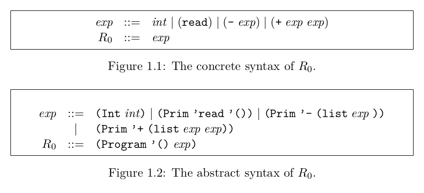

# Rust One Piece | R0

### 环境

+ 操作系统：linux/mac/unix，如果是 windows，可以使用 linux 子系统或者 [cygwin](http://www.cygwin.com/)
+ Rust: nightly 版，可执行 `rustup default nightly` 设置

### 前置知识

以下这段话翻译自 EOC 第一章开头

「通常，程序员所写的程序，是以文本的形式表示的，这称为程序的具体语法（concrete syntax）。在编译器内部，则使用数据结构来表示，这称为抽象语法（abstract syntax）。从抽象语法到具体语法的转换过程，称为 parsing。」

王垠称 parsing 是「[万里长征的第0步](http://www.yinwang.org/blog-cn/2015/09/19/parser)」。在 parsing 成抽象语法树 （AST）之后，真正的编译过程才开始。

在 EOC 中，不教导 parser 的知识，只专注于从高层次的 Racket 编译到底层 x86-64 汇编的过程。在本次教程中，则会写一个简单的 parser。

### 目标语言



作为一个好的开始，EOC 的第一节实现的语言很简单，而且仅实现了解释器。整个语言就是一个 S-表示式 exp，表达式是可以递归嵌套的。如果你先前不熟悉 Lisp 族语言，在后面实现的时候，可能需要多次回顾 R0 的语法。这里引用一些例子加深印象。

```python
# 合法的语法
(+ 10 (- (+ 12 20)))
(+ (read) (- (+ 5 3)))
# 不合法的语法
(+ 9)
(- 10 2)
```

注意，这里说的语言，其实是在说语言的具体语法，也就是通常我们写的文本形式。

### R0

现在，要用 Rust 写一个 R0 了，基本上是将书中的代码翻译成 Rust。我们要做三件事

+ 定义抽象语法结构
+ 写一个 R0 解释器
+ 写 Parser

#### 定义语法

当然，先创建一个项目

```sh
cargo new r0
```

在`src`下创建`syntax.rs`文件，写入

```rust
#[derive(Debug, PartialEq, Eq)]
pub enum Expr {
    Int(i64),
    Prim0(String),
    Prim1(String, Box<Expr>),
    Prim2(String, Box<Expr>, Box<Expr>),
}

pub use Expr::*;
```

我们定义了一个枚举类型 Expr，包含四种子类型。Int 表示整型自不用说，Prim0 表示无参数的函数，如`read`。类似地，Prim1 表示需要一个参数的函数，如`-`； Prim2 表示需要两个参数的函数，如`+`。Prim1 和 Prim2 的额外参数是 Expr 。`Box`在这里是因为 Expr 是一个递归结构，这部分的知识参看 [TRPL](https://doc.rust-lang.org/stable/book/ch15-01-box.html) 

`pub use Expr::*;`使得其他代码可以直接导入 Expr 的子类型。

这就是我们的抽象语法了！注意，为了简单点，我们没有定义`Program`这个结构。现在的`Program`也仅仅是一个包含 expr 的结构而已，所以去掉无妨，后面有需要我们再加上。

#### 解释器 R0

模仿书中的代码结构，R0 的主体如下

```rust
// main.rs
mod syntax;
mod helper;

pub use crate::syntax::Expr::{self, *};
pub use crate::helper::readint;

fn interp_exp(expr: Expr) -> i64 {
    match expr {
        Int ( val ) => val,
        Prim0 ( op )                if op.as_str() == "read" => readint(),
        Prim1 ( op, box e)          if op.as_str() == "-"    => -interp_exp(e),
        Prim2 ( op, box e1, box e2) if op.as_str() == "+"    => interp_exp(e1) + interp_exp(e2),
        _ => panic!("Invalid form!"),
    }
}
```
四种模式分别匹配 Expr 的四个子类型，因为目前我们只支持 `read, +, -`，所以用了`if`语句确认 `op`的值。一个简单的解释器完成！就这样！

#### box pattern

Expr 是一个递归结构，进行模式匹配的时候，使用了 box pattern，这是一个 nightly 版 Rust 才有的特性，所以需要在`main.rs`启用 box pattern，在第一行写入

```rust
#![feature(box_patterns)]
```

#### readint

在 R0 的代码中，我们使用了 `readint`，功能如同 EOC 中的 `read`，这并不是 Rust 内置的函数。它定义在`helper.rs`中

```rust
// helper.rs
use std::io::{self, Write};

pub fn readint() -> i64 {
    print!("input an integer: ");
    io::stdout().flush().expect("Faild to flush!");
    let mut v = String::new();
    io::stdin().read_line(&mut v)
        .expect("Failed to read line"); 
    return v.trim().parse().expect("Not an integer!");
}
```

#### 测试！

现在，写一个测试来跑 R0！在`main.rs`中引入测试模块`test.rs`

```rs
// main.rs
mod syntax;
mod helper;
mod test;       //  就放这里
```
然后在 `test.rs` 中写入
```rs
// test.rs
use crate::*;

#[test]
fn test_r0() {
    let p3 = Prim2 ("+".to_string(), Box::new(Int(10)), Box::new(Int(32)));
    let r = interp_exp(p3);
    assert_eq!(r, 42);
}
```

之后，运行`cargo test`

```sh
running 1 test
test test::test_r0 ... ok

test result: ok. 1 passed; 0 failed; 0 ignored; 0 measured; 0 filtered out
```

嘻嘻嘻！R0 完成！

#### 写 Parser

虽然，EOC 的第一章基本完成了（除了练习题 Partial Evaluator），不过每次都要手写**抽象语法**，太繁琐了。剩下的内容是写一个 Parser，帮助我们把具体语法转换为抽象语法。

Lisp 族语言的核心数据结构是 S 表达式。S 表达式有两种基本结构，原子 (atom) 和列表 (list) 。列表的元素是原子，或者是另一个列表，所以这又是一个递归结构。先看看这个定义

```rs
// parser.rs
#[derive(Debug, Eq, PartialEq)]
pub enum Sexpr {
    Atom(String),
    List(Vec<Sexpr>)
}

pub use Sexpr::{Atom, List};
```
如你所见，`Atom`的数据是字符串，`List`则是一个 S 表达式的向量。因此，Sexpr 是一个递归结构。

Parser 在正式 parse 之前，都会先生成一系列的 token，然后再把 token 转换成 AST 。

#### 生成 token

我们用一个 scan 函数来生成 token。这里的 token 仅仅是一个 Sexpr。

scan 的构思过程如下:

+ 接收一个输入，如 `(+ (+ 29 (- 8)) 10)`
+ 遇到`(`，意味着一个新的`List`开始了，遇到`)`意味着当前`List`已经结束了
+ 由于一个`List`没完成时，又有新的`List`要开始，所以旧的`List`应该用一个栈保存起来
+ 空格`' '`出现在元素之间，而且空格可以任意多个。遇到空格，要么代表当前的`Atom`解析完成，要么仅仅是多余的空格
+ 若是`0-9`，`A-z`，`+-*/`，则保存到当前的`Atom`中
+ 其他字符则忽略

基本思路就是这样，下面跟着注释一起看看代码

```rs
// parser.rs
pub fn scan(expr: &str) -> Sexpr {
    let mut stack = vec![];                 // 存放 List 的栈
    let mut sym = String::new();            // 解析当前的 Atom
    let mut list = vec![];                  // 解析当前的 List
    for c in expr.chars() {                 // 按字符遍历字符串
        match c {
            '(' => {                        // 新的 List 开始了
                stack.push(list);           // 把当前的 list 保存到栈上
                list = vec![];              // 新建一个 list
            }
            '0'..='9' => sym.push(c),       // 数字、运算符和字母都是合法的字符，加到当前的 Atom 上
            '+'|'-'|'*'|'/' => sym.push(c),
            'a'..='z'|'A'..='Z' => sym.push(c),
            ' ' => if !sym.is_empty() {     // 遇到空格了，如果当前正在解析 Atom，则意味着 Atom 解析完成了
                list.push(Atom(sym));       // 将 Atom 存入列表
                sym = String::new();        // 新建一个 Atom
            }                               
            ')' => {                        // 当前的 List 结束了
                if !sym.is_empty() {        // 如果有 Atom 未存入
                    list.push(Atom(sym));   // 则存入 
                    sym = String::new();    // 新建一个 Atom
                }
                let mut nlist = stack.pop().unwrap();   // 将上一个 list 出栈
                nlist.push(List(list));                 // 当前的 list 作为值存入
                list = nlist;                           // 将上一个 list 作为当前的 list 
            }
            _ => (),                        // 忽略其他字符
        }
    }    
    if !sym.is_empty() {        // 如果输入仅仅是一个原子，那么 sym 就非空
        return Atom(sym);
    } 
    return list.pop().unwrap(); // 否则，输入是一个列表
}
```

这里可能会有点难理解，如果读者有更好的方法，不吝赐教！

好啦，现在写个测试！记得把`mod parser;`加入到`main.rs`中

```rs
// test.rs
use crate::parser::*;

#[test]
fn test_scan() {
    let s = "(1 2 (+ 1 2))";
    let expr = scan(s);
    let t = List(vec![Atom("1".to_string()), Atom("2".to_string()), 
                        List(vec![Atom("+".to_string()), Atom("1".to_string()), Atom("2".to_string())])]);
    assert_eq!(expr, t);
}
```
确保`cargo test`输出如下内容

```sh
running 2 tests
test test::test_r0 ... ok
test test::test_scan ... ok

test result: ok. 2 passed; 0 failed; 0 ignored; 0 measured; 0 filtered out
```
你可以添加更多测试！

#### 生成 AST

token 已经有了，现在可以生成 AST 了。

由于目前我们只有 Int 类型一种原子类型，所以 `Atom(n) => Int(n)`。如果是列表，则要分三种情况，这跟我们的解释器的主体是一样的。

```rs
// parser.rs
use crate::*;

pub fn parse_sexpr(sexpr: &Sexpr) -> Expr {
    match sexpr {
        Atom(s) => {
            let val: i64 = s.parse().expect("Not an integer!");
            Int(val)
        },
        List(v) => {
            match v.as_slice() {
                [Atom(op)]         if op.as_str() == "read" => Prim0 ( op.to_string() ),
                [Atom(op), e]      if op.as_str() == "-"    => Prim1 ( op.to_string(), Box::new(parse_sexpr(e))),
                [Atom(op), e1, e2] if op.as_str() == "+"    => Prim2 ( op.to_string(), Box::new(parse_sexpr(e1)), Box::new(parse_sexpr(e2))),
                _ => panic!("Invalid form!"),
            }
        }
    }
}
```
由于 Rust 不支持 Vector 的解析，所以只能是以 slice pattern 的方式来解析。

最后，把前面两个函数合起来

```rs
// parser.rs
pub fn parse(expr: &str) -> Expr {
    let sexpr = scan(expr);
    let expr = parse_sexpr(&sexpr);
    return expr;
}
```

至此，Parser 也完成了！

同样的，写个测试
```rs
// test.rs
#[test]
fn test_parse() {
    let s = "(+ 1 2)";
    let expr = Prim2 ("+".to_string(), Box::new(Int(1)), Box::new(Int(2)));
    assert_eq!(parse(s), expr);
    let s = "(- 10)";
    let expr = Prim1 ("-".to_string(), Box::new(Int(10)));
    assert_eq!(parse(s), expr);
    let s = "(read)";
    let expr = Prim0 ("read".to_string());
    assert_eq!(parse(s), expr);
}
```

现在，以上的测试通过之后，说明我们有一个能用的 Parser 了。现在不需要手写抽象语法，只要写具体语法就好了。我们增加最后一个测试

```rs
// test.rs
#[test]
fn test_interp() {
    let s = "(+ 1 2)";
    let expr = parse(s);
    let r = interp_exp(expr);
    assert_eq!(r, 3);
}
```
确保测试通过哦！

### R0 入口

这一部分代码娱乐用的。我们把空荡荡的`main`函数改成以下代码

```rs
// main.rs
fn main() -> std::io::Result<()> {
    use parser::parse;
    use std::io::{self, Write};

    let mut v = String::new();
    loop {
        // input
        print!("User> ");
        io::stdout().flush()?;
        io::stdin().read_line(&mut v)?;
        // parse
        let exp = parse(v.as_str());
        v.clear();
        // interprete
        let res = interp_exp(exp);
        println!("{}", res);
        io::stdout().flush()?;
    }
}
```
`cargo run` 一下试试！


### 结语

EOC 的第一章完成了，有兴趣的话可以做做 1.6 的习题。看看这一节我们写的代码数量

```sh
syntax.rs : 8
main.rs   : 31
helper.rs : 9
parser.rs : 56
test.rs   : 35
----------------
total     : 139
```

如果你觉得学习 Rust 的语法或者 EOC 有疑惑，欢迎评论指出。Rust 大部分都可以在 TRPL 上查到。另外，[extensive API](https://doc.bccnsoft.com/docs/rust-1.36.0-docs-html/std/index.html)非常好用。

```rustup docs```可以打开本地文档，包含了 TRPL 和 extensive API。