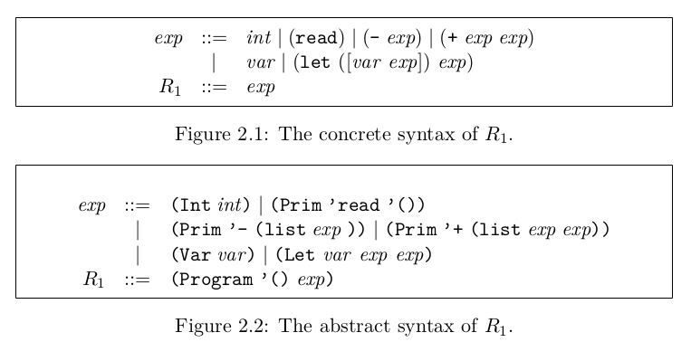

# Rust One Piece | R1 (一)

### 开始之前

在上一篇中，我们用了 100 行左右的代码写了一个简单的解释器 R0。EOC 第二章，我们准备写一个正经的编译器了。先直观地感受一下

```sh
# 代码量为我个人的实现
syntax.rs      : 108
helper.rs      : 39
parser.rs      : 63
main.rs        : 45
compiler.rs    : 327
test.rs        : 224
---------------------
total          : 806
```

上一篇是这一篇的基础，相同的地方将不再详细讲述。第二章的重点内容集中在`syntax.rs`，`compiler.rs`中。

### R1



R1 跟 R0 相比，增加了变量`Var`和赋值语句`Let`。看看几个例子

```python
(let ([x (+ 12 20)]) (+ 10 x))
(let ([x 32]) (+ (let ([x 10]) x) x))
```
在 lisp 中，let 是可以并行赋值多个变量的。如
```python
(let ([x 10]
      [y 32])
  (+ x y))
```
但在本章中，let 只支持赋值一个变量，所以我把方括号去掉了，语法简化成
```python
(let (x (+ 12 10))
    (+ 10 x))
```
这样我们就不需要修改上一篇的 `parser::scan` 函数，真不错！

### 变量绑定与环境

以下内容摘自 EOC 第二章 2.1 节

「当有多个 let 嵌套赋值同个变量的时候，最里面的 let 绑定将被使用。换句话说，当前对变量的绑定会暂时屏蔽 (overshadow) 前面的绑定。」 这通常称为局部作用域。举例来说 

```python
(let ([x 32]) 
    (+ (let ([x 10]) x) # 这个 x = 10
        x))             # 这个 x = 32
```
结果为 42。确保你理解了这个例子。

嗯，这是理所当然的。但是要怎么实现呢？ 书中提供了使用关联表的方法，下面阐述的是使用嵌套哈希表的方法。具体是这样的

+ 在一开始，初始化一个空的环境（类似一个哈希表）作为当前的环境，称为 env
+ 遇到 let 语句，新建一个环境，称为 new_env，把 let 语句中的变量和它的值记录到 new_env 中
+ 把 env 作为 new_env 的一个子环境，new_env 作为当前环境

查找变量的步骤：

+ 查找当前环境是否有这个变量，有则返回变量的值
+ 如果没有，则递归查找子环境。
+ 如果穷尽了子环境还是找不到，那就说明变量不存在，报错

所以，这一小节我们准备实现一个 R1 解释器，主要做以下几件事

+ 定义环境 
+ 拓展语法
+ 解释器 R1
+ 拓展 parser

但在开始之前，我们先来学习一下 Rust 的宏。

### Rust 的宏

以下定义了`string!`，它是`String::from`的简写版，我学习 Rust 宏的时候拿来练手的。宏包括三个部分：名称，调用格式以及展开式。

```rs
// helper.rs
#[macro_export]
macro_rules! string {                       // 宏名称，不带感叹号
    ( $x:expr ) => {                        // 调用格式
        {
            String::from($x)                // 展开式
        }
    };
}
```

`#[macro_export]`会把宏放到`crate`下，也就是说，你应该这样使用

```rs
use crate::string;
let s = string!("something");
```
`$x:expr`定义了一个表达式`$x`，可以在主体中使用：`String::from($x)`。我们趁热打铁，看看本篇会用到的另一个宏

```rs
// helper.rs
#[macro_export]
macro_rules! hashmap {
    ( $( $key:expr => $val:expr ),* ) => {
        {
            let mut map = std::collections::HashMap::new();
            $( map.insert( $key, $val ); )*
            map
        }
    };
}
```
`hashmap!`宏的格式为`( $( $key:expr => $val:expr ),* )`，最外面的括号表示你应该这样用`hashmap!(...)`。里面的`$( ... ),*`表示，这个模式可以重复 0 或任意多次，用逗号隔开。`$key:expr => $val:expr`就是具体的模式了，合起来表示你应该这样用`hashmap!( a => b, c => d)`。

`hashmap!`的功能类似于 Python 中的字典字面量。在 Python 中，你可以这样定义字典

```py
d = {"a": 1, "b": 2}
```
Rust 没有类似的方法。需要这样写

```rs
let mut d = HashMap::new();
d.insert("a", 1);
b.insert("b", 2);
```
有了`hashmap!`，你可以这样写

```rs
let mut d = hashmap!("a" => 1, "b" => 2);
```

### 环境

在 scip 的第三章以及王垠先生的[怎样写一个解释器](http://www.yinwang.org/blog-cn/2012/08/01/interpreter)都提到了如何定义环境，我主要参考了他们的做法。通过以下的这个例子，我们来学习 Rust 的泛型。

```rs
// syntax.rs
use std::collections::HashMap;
use std::rc::Rc;
use std::hash::Hash;

#[derive(Debug)]
pub struct SymTable<T, H> where T: Eq + Hash, H: Eq + Hash {
    pub map: HashMap<T, H>,
    env: Option<Rc<SymTable<T, H>>>,
}
```
`SymTable`意即符号表。它由一个哈希表和一个子环境组成。子环境是一个 Option 类型，说明可以为 None。第一个环境当然是没有子环境的。Rc 是一个不可变指针，支持多重所有权。这正是我们所需要的。当一个环境拓展的时候，它将保有一份子环境的引用，同时又不需要去复制子环境的数据。

`SymTable`引入两个类型变量，T 和 H，`where`子句表示，这两个类型都需要实现 trait `Eq`和`Hash`。通俗讲就是 T、H 都是可比较以及可哈希的。

下面跟着注释看看 SymTable 的方法，重点是 lookup 以及 extend。

```rs
impl<T, H> SymTable<T, H> where T: Eq + Hash, H: Eq + Hash {
    pub fn new() -> Self {
        SymTable {
            map: HashMap::new(), 
            env: None
        }
    }
    pub fn lookup(&self, x: &T) -> &H {
        if let Some(h) = self.map.get(x) {          // 先看看本环境有没有这个键，有则返回它的值
            return h;
        } else if let Some(env) = &self.env {       // 如果本环境没有，看看有没有子环境
            return env.lookup(x);                   // 有则让子环境去看看它有没有要查找的键
        } else {
            panic!("Undefine variable!");           // 如果子环境也没有，则说明这个变量没有定义
        }
    }

    pub fn bind(&mut self, var: T, val: H) -> Option<H> {
        return self.map.insert(var, val); 
    }

    pub fn extend(map: HashMap<T, H>, table: &Rc<SymTable<T,H>>) -> Self {
        SymTable { map, env: Some(Rc::clone(table)) }   // 将旧环境的引用保存到新环境中, Rc::clone 并不会复制数据，只是增加引用数
    }
}
```
同样的，我们应该测试一下。

```rs
#[test]
fn test_env2() {
    let env = Rc::new(SymTable::new());
    let map = hashmap!(string!("Jenny") => 100, string!("Good") => 42);
    let env2 = SymTable::<String, i64>::extend(map, &env);
    let v = env2.lookup(&"Jenny".to_string());
    assert_eq!(*v, 100);
}
```
你需要用`use`导入相关的符号，并确保测试通过。你也可以编写更多的测试用例～

### R1 语法
```rs
// syntax.rs
#[derive(Debug, PartialEq, Eq, Clone)]
pub enum Expr {
    Int ( i64 ),
    Var ( String ),
    Let ( Box<Expr>, Box<Expr>,  Box<Expr> ),
    Prim0 ( String ),
    Prim1 ( String, Box<Expr> ),
    Prim2 ( String, Box<Expr>, Box<Expr> ),
}
```
与 R0 相似，增加了 Var 和 Let 。

### 解释器 R1

R0 已经支持的操作基本不需要改变，除了多传一个 SymTable 参数～而支持变量是很简单的。当 R1 遇到一个变量的时候，它就去环境中找对应的值。对于 let，则需要把当前的绑定放到一个新的环境中，然后对 let 的主体进行求值。

```rs
// main.rs
use std::rc::Rc;
pub use crate::syntax::Expr::{self, *};
pub use crate::syntax::SymTable;

fn interp_exp(expr: Expr, env: Rc<SymTable<String, i64>>) -> i64 {
    match expr {
        Int ( n ) => n,
        Prim0 ( op )                if op.as_str() == "read" => helper::readint(),
        Prim1 ( op , box e )        if op.as_str() == "-"    => -interp_exp(e, env),
        Prim2 ( op, box e1, box e2) if op.as_str() == "+"    => interp_exp(e1, Rc::clone(&env)) + interp_exp(e2, env),
        Var ( x ) => *env.lookup(&x),
        Let (box Var ( x ), box e1, box e2) => {
            let val = interp_exp(e1, Rc::clone(&env));
            let new_env: SymTable<String, i64> = SymTable::extend(hashmap!(x => val), &env);
            return interp_exp(e2, Rc::new(new_env));
        } 
        _ => panic!("bad syntax!"),
    }
}

fn interp_r1(expr: Expr) -> i64 {
    let env = Rc::new(SymTable::new());
    return interp_exp(expr, env);
}
```

测试一下？由于现在的 Parser 还不支持 let，我们只好自己写了。。。
```rs
#[test]
fn test_nest_let() {
    let exp = Let(Box::new(Var(string!("x"))), Box::new(Int(8)), 
                Box::new(Let(Box::new(Var(string!("y"))), Box::new(Int(34)), Box::new(Prim2(string!("+"), Box::new(Var(string!("x"))), Box::new(Var(string!("y"))))))));
    assert_eq!(42, interp_r1(exp));
}
```

### 拓展 Parser

保持 scan 和 parse 不变，我们只需要拓展 `parse_sexpr`。

```rs
// parser.rs
pub fn parse_sexpr(sexpr: &Sexpr) -> Expr {
    match sexpr {
        Atom(s) => if is_digit(s) { Int(s.parse().unwrap())} else { Var(s.to_string()) }
        List(v) => match v.as_slice() {
            // let expression
            [Atom(op), List(bind), exp] if op.as_str() == "let" => {
                match bind.as_slice() {
                    [Atom(var), val] if !is_digit(var) => {
                        Let( Box::new(Var(var.to_string())), Box::new(parse_sexpr(val)), Box::new(parse_sexpr(exp)) )
                    },
                    _ => panic!("variable could not be digit!"),
                }
            },
            // prim
            [Atom(op), e1, e2] if op.as_str() == "+"    => Prim2 ( string!("+"), Box::new( parse_sexpr(e1)), Box::new(parse_sexpr(e2))),
            [Atom(op), e]      if op.as_str() == "-"    => Prim1 ( string!("-"), Box::new( parse_sexpr(e))),
            [Atom(op)]         if op.as_str() == "read" => Prim0 ( string!("read")),
            _ => panic!("Invalid syntax!"),
        }
    }
}
```
现在 Atom 有两种类型了，整型和变量。所以需要判断 Atom(x) 中的 x 是否能表示一个数字。对于 let 语句，需要判断它的变量是否合法。如果它是一个数字，则不是合法的变量。`is_digit`的定义如下

```rs
// helper.rs
pub fn is_digit(s: &str) -> bool {
    for c in s.chars() {
        if !c.is_digit(10) {
            return false;
        }
    }
    return true;
}
```
同样的，测试一下，现在可以用 let 了 :-) 
```rs
#[test]
fn test_interp_r1_shadow() {
    let e = "(let (x 10)
                (let (y 4)
                    (let (x 20)
                        (+ x y))))";
    let exp = parse(e);
    let res = interp_r1(exp);
    assert_eq!(24, res);
}
```
更多更全的测试请参考代码哦～

来到这里，解释器 R1 已经完成了！然而，这仅仅是 EOC 的 2.1 节 ... ...

### 结语

这一篇我们学习了 Rust 的泛型以及宏，拓展 R0 到 R1 以支持变量和局部作用域。下一篇我们将从整体上看看编译到 x86-64 所需要的步骤，也就是 EOC 2.2 节的内容。

在这一篇中，我有意忽略了一些必要的 `use crate::xxx` 语句和许多测试用例，以免分散注意力。读者若有需要，可参考仓库的代码。