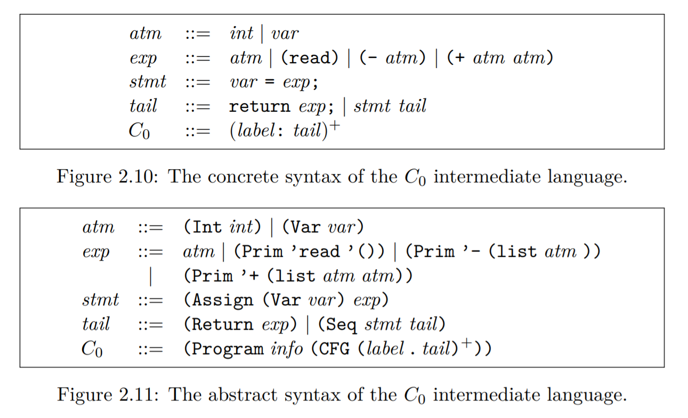
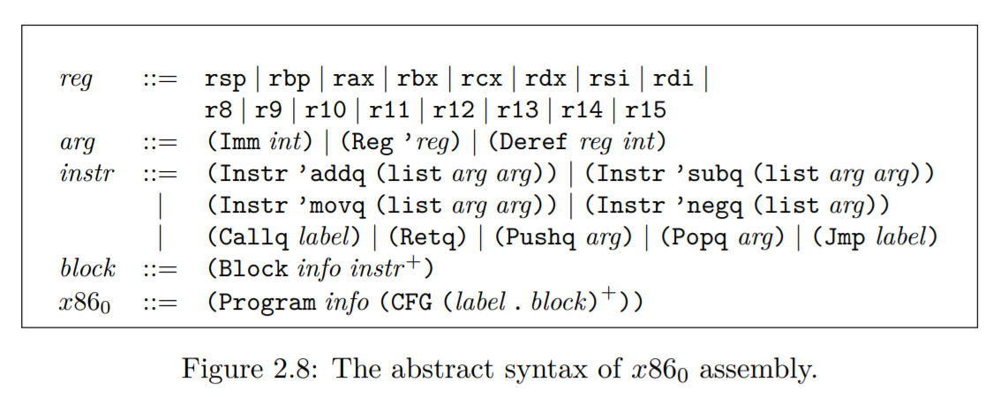

# Rust One Piece | R1（三）

这一节的内容是从 R1 编译到中间语言，C0。先看看 C0 的语法。




C0 的语法像 C 语言，有赋值和返回语句。不过，因为我只使用了它的抽象语法，所以就没必要为它写 Parser 了。

### C0

先定义 C0
```rs
// syntax.rs
#[derive(Debug, PartialEq, Eq, Clone, Hash)]
pub enum C0 {
    Int(i64),
    Var(String),
    Prim0(String),
    Prim1(String, Box<C0>),
    Prim2(String, Box<C0>, Box<C0>),
    Assign(Box<C0>, Box<C0>),
    Return(Box<C0>),
    Seq(Box<C0>, Box<C0>),
}

#[derive(Debug)]
pub struct C0Program {
    pub locals: Vec<C0>,
    pub cfg: Vec<(String, C0)>,
}
```

`C0Program`表示一个 C0 程序，它包括变量`locals`以及多个代码块`cfg`。每个代码块是一个元组`(String, C0)`。目前，我们只有一个代码块`start`。

从 C0 的语法定义可知，C0 的主体是一个 Tail 语句。一个 tail 语句可以是一个 return 语句，也可以是一个 stmt 加上另一个 tail，所以 tail 是一个递归结构。它的抽象语法表示为 Return 和 Seq 两个结构。因此，就目前而言，C0 程序是一个 Return 或者一个 Seq 语句。

而 R1 中与 tail 对应的结构是 let 。因为 let 也可以赋值，也可以有返回值。所以，R1 -> C0 的关键是将 Let 变换到 Seq 。

### explicate-control

对于这个 pass，我分三步来完成，自觉略为繁琐。如果读者有更好的做法，希望能不吝赐教。

```rs
use crate::syntax::{C0, C0Program};
pub fn explicate_control(expr: Expr) -> C0Program {
    let expr = let_to_seq(expr);
    let expr = flatten_seq(expr);
    let locals = collect_vars(&expr);
    C0Program { locals, cfg: vec![("start".to_string(), expr)]}
}
```

如代码所示

+ 先把 Let 语句全部转换为 C0::Seq 语句。
+ 将包含递归的 Seq 展平成可以按顺序执行的 Seq，类似尾递归。
+ 从表达式中收集变量。

```rs
pub fn let_to_seq(expr: Expr) -> C0 {
    match expr {
        Int(n) => C0::Int(n),
        Var(x) => C0::Var(x),
        Prim0(op) => C0::Prim0(op),
        Prim1(op, box e) => C0::Prim1(op, Box::new( let_to_seq(e) )),
        Prim2(op, box e1, box e2) => C0::Prim2(op, Box::new( let_to_seq(e1) ), Box::new( let_to_seq(e2) )),
        Let(box Var(x), box e, box body) => {
            let assign = C0::Assign(Box::new(C0::Var(x)), Box::new(let_to_seq(e)));
            C0::Seq(Box::new(assign), Box::new(let_to_seq(body)))
        }
        _ => panic!("bad syntax"),
    }
}
```
`let_to_seq` 只进行纯类型转换，把 Expr 类型转换为 C0 中对应的类型。注意到这里对 Let 的转换，是不符合 C0 的语法定义的。因为 C0 中规定，`stmt` 中的最后一个语句是一个 `exp`，而我们这里则允许是一个 `tail`。所以，下一步是按照代码的执行顺序，把 `Seq` 展平。比如

```lisp
(Seq (Assign x1
        (Seq (Assign x2 e) 
             t2)) 
     t1)
```
展开成
```lisp
(Seq (Assign x2 e)
    (Seq (Assign x1 t2)
        t1))
```

可以看到，x1 在 x2 前面，但赋值却在 x2 后面，所以我们需要一个栈来保存 x1 的赋值语句。

```rs
pub fn flatten_seq(expr: C0) -> C0 {
    use C0::*;
    let mut stack = Vec::new();
    let mut tail = Return(Box::new(flatten_seq_helper(expr, &mut stack)));
    while let Some(assign) = stack.pop() {
        let seq = Seq(Box::new(assign), Box::new(tail));
        tail = seq; 
    }
    return tail;
}

pub fn flatten_seq_helper(expr: C0, stack: &mut Vec<C0>) -> C0 {
    use C0::*;
    match expr {
        Seq(box Assign(box x, box e), box tail) => {
            let e = flatten_seq_helper(e, stack);
            let assign = Assign(Box::new(x), Box::new(e));
            stack.push(assign);
            return flatten_seq_helper(tail, stack);
        }
        e => e,
    }
}
```
先看 `flatten_seq_helper`，它一遇到 Seq 就递归进入 Seq 中，把 Assign 语句放入栈中，如果是其他语句，则直接返回。而 `flatten_seq` 就从最后一个 Seq 开始构建，把后一个 Seq 作为前一个 Seq 的 tail，这样就完成了转换！

最后，我们只需要收集这个 Seq 中的变量就好了。

```rs
fn collect_vars(mut expr: &C0) -> Vec<C0> {
    use C0::*;
    let mut vars = vec![];
    while let Seq(box Assign(box x, box _e), box tail) = expr {
        vars.push(x.clone());
        expr = tail;
    }
    return vars;
}
```

这样，`explicate-control` 也完成了，最后还是测试一下~

```rs
use crate::syntax::{C0Program, C0};
#[test]
fn test_explicate_control() {
    use C0::*;
    let e = "(let (x (+ 1 2))
                x)";
    let exp = parse(e);
    let exp = explicate_control(exp);
    let C0Program { locals, cfg: mut blocks } = exp;
    let (label, codes) = blocks.pop().unwrap();
    assert!(matches!(&codes, Seq(box Assign(box Var(x), box Prim2(add, box Int(n1), box Int(n2))), box Return(box Var(x_))) if x == x_));
}
```
这里用了 `matches` 宏，左边是表达式，右边是模式，跟 match 是相似的用法。

### x86_0

现在，需要把 C0 转换到 x86_0 了。先看看 x86_0 的抽象语法。



我的定义有一点不同。用 Op1 表示有一个参数的指令，Op2 表示有两个参数的指令。

```rs
// syntax.rs
#[derive(Debug, PartialEq, Eq, Clone, Hash)]
pub enum x86 {
    RSP, RBP, RAX, RBX, RCX, RDX, RSI, RDI, 
    R8, R9, R10, R11, R12, R13, R14, R15,
    Imm(i64),
    Var(String),
    Deref(Box<x86>, i64),
    Op1(String, Box<x86>),
    Op2(String, Box<x86>, Box<x86>),
    Callq(String),
    Retq,
    Pushq(Box<x86>),
    Popq(Box<x86>),
    Jmp(String),
}

#[derive(Debug)]
pub struct x86Block {
    pub locals: Vec<x86>,
    pub instructions: Vec<x86>,
    pub stack_space: usize,
    pub name: String,
}
```
`x86Block` 的字段后面会用到，这里先定义好。locals 记录这个代码块中会用到的变量；instructions 是一系列的指令；stack_space 是指代码块需要分配的栈空间；name 是代码块的标签。


### select instruction

现在可以来写这个 Pass 了。回顾一下，我们要做的是这样的转换

```C
x = (+ 10 32);
// 转换成
movq $10, x
addq $32, x
```
另一个例子
```C
x = (+ x 10);
// 转换成
addq $10, x
```

以下的内容，如果你对 AT&T 的汇编语法有所了解，会好理解一些。

```rs
// compiler.rs
use crate::syntax::{x86, x86Block, x86Program};
pub fn select_instruction(prog: C0Program) -> x86Block {
    let C0Program { locals, mut cfg } = prog;
    let (label, codes_C0) = cfg.pop().unwrap();
    let instructions = C0_to_x86(codes_C0);
    let locals = vars_c0_to_x86(locals);
    let x86_block = x86Block { instructions, locals, stack_space: 0, name: "start".to_string() };
    return x86_block;
}
```

先看看简单的 `vars_c0_to_x86`，只是简单的 C0::Var -> x86::Var。

```rs
fn vars_c0_to_x86(locals: Vec<C0>) -> Vec<x86> {
    let mut new_vars = vec![];
    for x in locals.into_iter() {
        if let C0::Var(x) = x {
            new_vars.push( x86::Var(x) );
        }
    }
    return new_vars;
}
```

下面来看看复杂一些的 `C0_to_x86`

+ C0_to_x86 提供一个 Vec<x86> 的包装
+ C0_to_x86_helper 解析 Seq，并把具体的指令传递给 assign_helper
+ assign_helper 是核心函数，它把具体的指令转换成 x86 的抽象语法

```rs
pub fn C0_to_x86(expr: C0) -> Vec<x86> {
    let mut instr = vec![];
    C0_to_x86_helper(expr, &mut instr);
    return instr;
}

pub fn C0_to_x86_helper(expr: C0, code: &mut Vec<x86>) {
    use C0::*;
    match expr {
        Assign(box Var(x), box e) => assign_helper(e, x86::Var(x), code),
        Return(box e) => {
            assign_helper(e, x86::RAX, code);
            code.push( x86::Jmp("conclusion".to_string()) );
        }
        Seq(box assign, box tail) => {
            C0_to_x86_helper(assign, code);
            C0_to_x86_helper(tail, code);
        },
        _ => panic!("bad syntax"),
    }
} 

fn assign_helper(source: C0, target: x86, code: &mut Vec<x86>) {
    use C0::*;
    match source {
        Int(n) => code.push( x86::Op2("movq".to_string(), Box::new(x86::Imm(n)), Box::new(target))),
        Var(y) => code.push( x86::Op2("movq".to_string(), Box::new(x86::Var(y)), Box::new(target))),
        Prim0(read) if read.as_str() == "read" => {
            code.push( x86::Callq("read_int".to_string()));
            code.push( x86::Op2("movq".to_string(), Box::new(x86::RAX), Box::new(target)));
        },
        Prim2(add, box e1, box e2) if add.as_str() == "+" => {
            match (e1, e2) {
                (Int(n1), Int(n2)) => {
                    code.push( x86::Op2("movq".to_string(), Box::new(x86::Imm(n1)), Box::new(target.clone())));
                    code.push( x86::Op2("addq".to_string(), Box::new(x86::Imm(n2)), Box::new(target)));
                },
                (Var(y), Int(n)) | (Int(n), Var(y)) => {
                    if let x86::Var(x) = &target {
                        if y.as_str() == x.as_str() {
                            code.push( x86::Op2("addq".to_string(), Box::new(x86::Imm(n)), Box::new(target)));
                        } else {
                            code.push( x86::Op2("movq".to_string(), Box::new(x86::Imm(n)), Box::new(target.clone())));
                            code.push( x86::Op2("addq".to_string(), Box::new(x86::Var(y)), Box::new(target)));
                        }
                    } else {
                        code.push( x86::Op2("movq".to_string(), Box::new(x86::Imm(n)), Box::new(target.clone())));
                        code.push( x86::Op2("addq".to_string(), Box::new(x86::Var(y)), Box::new(target)));
                    }
                },
                (Var(y), Var(z)) => {
                    if let x86::Var(x) = &target {
                        if y.as_str() == x.as_str() {
                            code.push( x86::Op2("addq".to_string(), Box::new(x86::Var(z)), Box::new(target)));
                        } else if z.as_str() == x.as_str() {
                            code.push( x86::Op2("addq".to_string(), Box::new(x86::Var(y)), Box::new(target)));
                        } else {
                            code.push( x86::Op2("movq".to_string(), Box::new(x86::Var(y)), Box::new(target.clone())));
                            code.push( x86::Op2("addq".to_string(), Box::new(x86::Var(z)), Box::new(target)));
                        }
                    } else {
                        code.push( x86::Op2("movq".to_string(), Box::new(x86::Var(y)), Box::new(target.clone())));
                        code.push( x86::Op2("addq".to_string(), Box::new(x86::Var(z)), Box::new(target)));
                    }
                }
                _ => panic!("uncover"),
            }
        },
        Prim1(neg, box e) if neg.as_str() == "-" => {
            match e {
                Int(n) => {
                    code.push( x86::Op2("movq".to_string(), Box::new(x86::Imm(n)), Box::new(target.clone())) );
                    code.push( x86::Op1("negq".to_string(), Box::new(target)));
                },
                Var(y) => {
                    code.push( x86::Op2("movq".to_string(), Box::new(x86::Var(y)), Box::new(target.clone())) );
                    code.push( x86::Op1("negq".to_string(), Box::new(target)));
                },
                _ => panic!("bad syntax!"),
            };
        },
        _ => panic!("Invalid form for assignment!"),
    };
}
```

关于 assign_helper 我暂时还没有更好的方法来缩减它的尺寸。它是依赖于你所采用的具体 x86-64 语法的。我举一个小例子来帮助读者理解这个函数。

```rs
x = (+ 1 2)
return x
// 简化版的抽象语法
Seq ( Assign (x, Prim2(+, 1, 2)),
      Return x )
```
首先是调用 C0_to_x86，我们白拴了一个 Vec<x86>，其次是 C0_to_x86_helper，我们 match 到了

```rs
    Seq(box assign, box tail) => {
        C0_to_x86_helper(assign, code);
        C0_to_x86_helper(tail, code);
    },
```
所以，接下来我们会进入对 Assign 的匹配，

```rs
    Assign(box Var(x), box e) => assign_helper(e, x86::Var(x), code),
```
这里 x 匹配到了 x，e 匹配到了 Prim2(+, 1, 2)。现在进入 assign_helper 了。匹配到以下的部分

```rs
        Prim2(add, box e1, box e2) if add.as_str() == "+" => {
            match (e1, e2) {
                (Int(n1), Int(n2)) => {
                    code.push( x86::Op2("movq".to_string(), Box::new(x86::Imm(n1)), Box::new(target.clone())));
                    code.push( x86::Op2("addq".to_string(), Box::new(x86::Imm(n2)), Box::new(target)));
                },
        // ...
```

所以，我们得到了

```s
movq $n1, target
addq $n2, target
```

现在对 Seq 中 assign 的转换已经完成了，进入 tail 的部分。匹配到

```rs
    Return(box e) => {
        assign_helper(e, x86::RAX, code);
        code.push( x86::Jmp("conclusion".to_string()) );
    }
```

我们得到

```s
movq e, %rax
jmp conclusion
```

确保你已经理解了上述过程，希望你会有更好的解法！
 
测试一下

```rs
use crate::syntax::{x86, x86Block};
#[test]
fn test_select_instruction() {
    use x86::*;
    let e = "(let (a 42)
                (let (b a)
                    b))";
    let exp = parse(e);
    let exp = remove_complex_opera(exp);
    let exp = explicate_control(exp);
    let block = select_instruction(exp);
    let x86Block { locals, instructions, stack_space, name } = block;
    match instructions.as_slice() {
        [_mov1, _mov2, _mov3, jump] => assert!(matches!(jump, Jmp(label) if label.as_str() == "conclusion")),
        _ => panic!("fails in select instruction"),
    }
}
```

### 结语

这一节的内容很多，R1 -> C0 -> x86_0 这个过程已经完成了，剩下的内容我们放最后一篇。