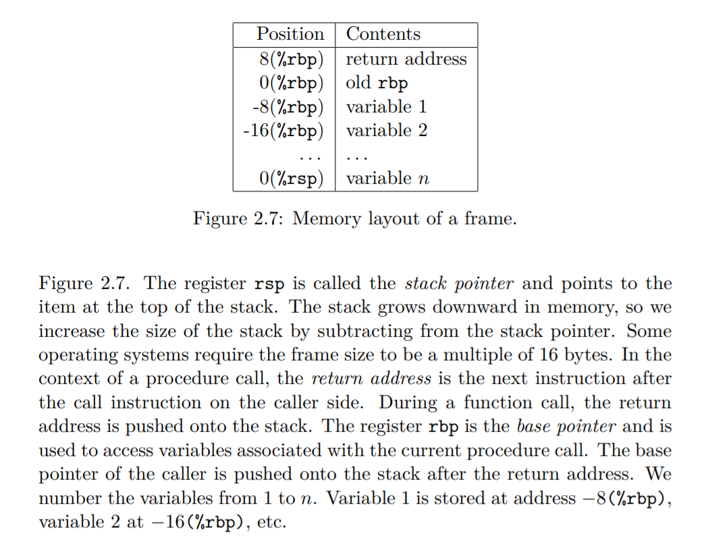
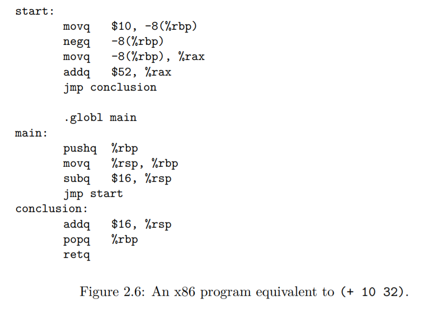

# Rust One Piece | R1（四）

本篇将 R1 编译器剩下的 3 个 pass 写完。

### assign-homes

这里回顾一下

+ assign-homes 将变量映射到寄存器或者内存上，在这一节只映射到内存，EOC 第三章会学习一个寄存器分配的算法。

```rust
locals: a b
start:
    movq $42, a
    movq a, b
    movq b, %rax
    jmp conclusion
// 转换成
stack-space: 16
start:
    movq $42, -8(%rbp)
    movq -8(%rbp), -16(%rbp)
    movq -16(%rbp), %rax
    jmp conclusion 
```

EOC 的 2.2 节较为详细地讲解了 x86 汇编相关的知识，完成这个 pass 至少需要知道，在函数调用的时候，参数是如何被存储的。



精要的翻译：「rsp 是栈指针，指向栈顶。栈在内存中是向下增长的，因而减小 rsp 的值能扩大栈的容量。某些操作系统要求栈的大小为 16 字节的倍数。当发生函数调用的时候，返回地址入栈。rbp 就一个基指针，在函数调用期间用来获取所传参数的值，比如第一个参数位于 -8(%rbp)，第二个位于 -16(%rbp)，依此类推。」

在上一个 pass 中，我们已经收集好了变量。这个 pass 只需要按顺序给变量分配一个位置，然后把表达式中的变量逐个替换成对应的位置就行了！

```rs
// compiler.rs
const FRAME: usize = 16;
const BYTE: usize = 8;
pub fn assign_homes(block: x86Block) -> x86Block {
    let x86Block { locals, instructions, stack_space, name} = block;
    let stack_space = align_address(locals.len() * BYTE, FRAME);
    let symtable = build_symbol_table(&locals);
    let instructions = assign_homes_helper(instructions, &symtable);
    return x86Block {locals, instructions, stack_space, name};
}
```
EOC 2.8 节提示我们计算一个栈空间，所以我先根据变量的个数计算出来，这是由 align_address 完成的。由于它比较简单，所以标注它为内联函数。

```rs
#[inline]
fn align_address(space: usize, align: usize) -> usize {
    let remain = space % align;
    if remain == 0 { space } else { space + align - remain }
}
```

第二步是建立一个变量名-栈位置的对应表，我们按顺序给变量分配位置就好了。在我们的 x86 抽象语法中，栈的位置是由 Deref 来表示的。这是 EOC 中给的名字，跟 Rust 本身的 Deref 是不一样的~
```rs
fn build_symbol_table(locals: &Vec<x86>) -> SymTable<&x86, x86> {
    use x86::*;
    let mut symtable = SymTable::new();
    for (i, var) in locals.iter().enumerate() {
        symtable.bind(var, Deref(Box::new(RBP), (i+1) as i64 * -8));
    }
    return symtable;
}
```

有了对应表，我们就可以遍历表达式，遇到变量，就换成变量在表中的值。

```rs
fn assign_homes_helper(instr: Vec<x86>, symtable: &SymTable<&x86, x86>) -> Vec<x86> {
    use x86::*;
    fn helper(expr: x86, symtable: &SymTable<&x86, x86>) -> x86 {
        match expr {
            Var(x)  => symtable.map.get(&Var(x)).unwrap().clone(),
            Op1(op, box e) => Op1(op, Box::new(helper(e, symtable))),
            Op2(op, box e1, box e2) => Op2(op, Box::new(helper(e1, symtable)), Box::new(helper(e2, symtable))),
            e => e,
        }
    }
    let instr = instr.into_iter().map(|e| helper(e, symtable)).collect();
    return instr;
}
```
在 x86 的抽象语法中，只有 Var, Op1, Op2 带变量，所以只对这三个子类型进行处理，其他的原样返回。

现在可以测试一下了

```rs
#[test]
fn test_assign_homes() {
    use x86::*;
    let e = "(let (a 42)
                (let (b a)
                    b))";
    let exp = parse(e);
    let exp = remove_complex_opera(exp);
    let exp = explicate_control(exp);
    let block = select_instruction(exp);
    let block = assign_homes(block);
    let x86Block { locals, instructions, stack_space, name } = block;
    match instructions.as_slice() {
        [mov1, mov2, mov3, _jump] => {
            assert!(matches!(mov1, Op2(mov, box Imm(n), box Deref(box reg, disp)) 
                                    if mov.as_str() == "movq" && *n == 42 && *reg == x86::RBP && *disp == -8));
            assert!(matches!(mov2, Op2(mov, box Deref(box reg1, disp1), box Deref(box reg2, disp2)) 
                                    if mov.as_str() == "movq" && reg1 == reg2 && *disp1 == -8 && *disp2 == -16));
            assert!(matches!(mov3, Op2(mov, box Deref(box reg, disp), box rax) 
                                    if mov.as_str() == "movq" && *reg == x86::RBP && *disp == -16 && *rax == x86::RAX));
        },
        _ => panic!("test assign_home fails"),
    }
}
```

### patch instructions

+ patch-instructions 是一个补丁，将修复前面 pass 的一些问题。如在上一个 pass 中，允许内存与内存之间的操作，这一个 pass 将修复这样的操作。因为实际上 intel 的 x86-64 不存在这样的指令。

```rs
movq -8(%rbp), -16(%rbp)
// 转换成                    
movq -8(%rbp), %rax,
movq %rax, -16(%rbp)
```

现在，可以打补丁了。目前，只有一个补丁。


```rs
pub fn patch_instructions(block: x86Block) -> x86Block {
    use x86::*;
    let x86Block { locals, instructions, stack_space, name } = block;
    let mut new_instructions = vec![];
    for instr in instructions.into_iter() {
        match instr {
            Op2(movq, box Deref(box reg1, n1), box Deref(box reg2, n2)) => {
                new_instructions.push( Op2(movq.clone(), Box::new(Deref(Box::new(reg1), n1)), Box::new(RAX)));
                new_instructions.push( Op2(movq, Box::new(RAX), Box::new(Deref(Box::new(reg2), n2))));
            },
            e => new_instructions.push( e ),
        }
    }
    return x86Block { locals, instructions: new_instructions, stack_space, name };
}
```

写个测试

```rs
#[test]
fn test_patch_instructions() {
    use x86::*;
    let e = "(let (a 42)
                (let (b a)
                    b))";
    let exp = parse(e);
    let exp = remove_complex_opera(exp);
    let exp = explicate_control(exp);
    let block = select_instruction(exp);
    let block = assign_homes(block);
    let block = patch_instructions(block);
    let x86Block { locals, instructions, stack_space, name } = block;
    match instructions.as_slice() {
        [_mov1, mov2, mov3, _mov4, _jump] => {
            assert!(matches!(mov2, Op2(mov, box Deref(box reg1, disp1), box rax) 
                                    if mov.as_str() == "movq"  && *rax == x86::RAX));
            assert!(matches!(mov3, Op2(mov, box rax, box Deref(box reg, disp)) 
                                    if mov.as_str() == "movq" && *reg == x86::RBP && *disp == -16 && *rax == x86::RAX));
        },
        _ => panic!("test assign_home fails"),
    }
}
```

### print-x86 

+ print-x86 这个 pass 将 x86 的抽象语法转化为具体语法，是编译的最后一步。

在这个 pass 里，我们除了把表达式中的指令写到文件里，还要包含其他必要的指令。如书中的例子



主程序是 start 部分，全局入口 .globl main，main 和 conclusion 分别定义了进入 start 之前的前置和后置代码。

先给出代码结构。

```rs
use std::io::Write;
use std::fs::File;
pub fn print_x86(block: x86Block, filename: &str) -> std::io::Result<()> {
    let prelude = build_prelude(block.stack_space, &block.name);
    let conclusion = build_conclusion(block.stack_space);

    let mut file = File::create(filename)?;
    print_globl_entry(&mut file)?;
    print_block(prelude, &mut file)?;
    print_block(block, &mut file)?;
    print_block(conclusion, &mut file)?;
    return Ok(()); 
}
```

我们先分别给前置代码和后置代码建一个代码块，然后按顺序把代码块的内容写到文件中，就这样！


全局入口的代码

```rs
fn print_globl_entry(file: &mut File) -> std::io::Result<usize> {
    if std::env::consts::OS == "macos" {
        file.write(b".globl _main\n")
    } else {
        file.write(b".globl main\n")
    }
}
```

前置代码块

```rs
fn build_prelude(stack_space: usize, jump_to: &String) -> x86Block {
    use x86::*;
    let name = "main".to_string();
    let instructions = vec![
        Pushq(Box::new(RBP)),
        Op2("movq".to_string(), Box::new(RSP), Box::new(RBP)),
        Op2("subq".to_string(), Box::new(Imm(stack_space as i64)), Box::new(RSP)),
        Jmp(jump_to.to_string()),
    ];
    x86Block {name, instructions, stack_space: 0, locals: vec![]}
}
```

后置代码块

```rs
fn build_conclusion(stack_space: usize) -> x86Block {
    use x86::*;
    let name = "conclusion".to_string();
    let instructions = vec![
        Op2("addq".to_string(), Box::new(Imm(stack_space as i64)), Box::new(RSP)),
        Popq(Box::new(RBP)),
        Retq,
    ];
    x86Block {name, instructions, stack_space:0, locals:vec![]}
}
```

现在，我们只需要写个 print_block 函数就完成了！

```rs
fn print_block(block: x86Block, file: &mut File) -> std::io::Result<()> {
    let x86Block { locals, instructions, stack_space, name } = block;
    file.write(name.as_bytes())?;
    file.write(b":\n")?;
    print_instructions(instructions, file)?;
    Ok(())
}
```

这个函数很简单，它打印了标签名之后，就调用了 print_instructions 。

```rs
fn print_instructions(instructions: Vec<x86>, file: &mut File) -> std::io::Result<()> {
    use x86::*;
    for instr in instructions.into_iter() {
        let code = format!("    {}\n", instr);
        file.write(code.as_bytes())?;
    }
    return Ok(());
}
```

这个函数也很简单！它只是把指令逐个取出来，然后 format! 成字符串的形式，写到文件中而已。

但是，直接运行上述代码会有问题，因为 format! 不知道如何对 x86 进行转换。

```rs
error[E0277]: `x86` doesn't implement `std::fmt::Display`
```

编译器提示我们，要实现 Display 这个 trait。现在，我们采用面向编译器编程的方法，在 extensive API 上搜索 Display，可以找到这个[示例](https://doc.rust-lang.org/stable/std/fmt/trait.Display.html#required-methods)

然后，我们依样画葫芦，在`syntax.rs`中加入以下代码

```rs
use std::fmt;
impl fmt::Display for x86 {
    fn fmt(&self, f: &mut fmt::Formatter<'_>) -> fmt::Result {
        use x86::*;
        match self {
            RAX => write!(f, "%rax"), RBX => write!(f, "%rbx"), RCX => write!(f, "%rcx"), RDX => write!(f, "%rdx"), 
            RSI => write!(f, "%rsi"), RDI => write!(f, "%rdi"), RBP => write!(f, "%rbp"), RSP => write!(f, "%rsp"), 
            R8  => write!(f, "%r8"),  R9  => write!(f, "%r9"),  R10 => write!(f, "%r10"), R11 => write!(f, "%r11"), 
            R12 => write!(f, "%r12"), R13 => write!(f, "%r13"), R14 => write!(f, "%r14"), R15 => write!(f, "%r15"),
            Imm(n) => write!(f, "${}", n),
            Deref(box reg, n) => write!(f, "{}({})", n, reg),
            Op1(op, box e) => write!(f, "{} {}", op, e),
            Op2(op, box e1, box e2) => write!(f, "{} {}, {}", op, e1, e2),
            Callq(function) => write!(f, "callq {}", function),
            Retq => write!(f, "retq"),
            Pushq(box reg) => write!(f, "pushq {}", reg),
            Popq(box reg) => write!(f, "popq {}", reg),
            Jmp(label) => write!(f, "jmp {}", label),
            e => panic!("invalid x86 code"),
        }
    }
}
```
这里，我们为 x86 的每个指令都指定了它的打印格式。比如

```rs
println!(x86::RAX); // => %rax
println!(x86::Imm(4)); // => $4
```

这是 AT&T 的汇编格式，至此，编译过程全部完成！

### 编译入口

现在，把这些编译的 pass 串起来

```rs
// main.rs
fn compile(expr: &str, filename: &str) -> std::io::Result<()> {
    use crate::parser::parse;
    use crate::compiler::*;
    let expr = parse(expr);
    let expr = uniquify(expr);
    let expr = remove_complex_opera(expr);
    let expr = explicate_control(expr);
    let expr = select_instruction(expr);
    let expr = assign_homes(expr);
    let expr = patch_instructions(expr);
    print_x86(expr, filename);
    Ok(())
}

fn main() -> std::io::Result<()> {
    let s = "(let (x 10) x)";
    compile(s, "r1.asm")
}
```

运行之后，会生成一个 `r1.asm` 文件。你需要 gcc 来编译和运行它。

```bash
as r1.asm -o r1.o
gcc r1.o -o r1
./r1
echo $?
```

如果需要 `(read)` 语句，则需要把官方提供的 `runtime.c` 一起编译。

### 结语

至此，我们已经完成 EOC 第二章的内容了（除了课后题）。在下一章，我们将实现一个寄存器分配算法。也许需要明确的一点是，我的 Rust 并不好，所以你不必拘泥于我的实现，也欢迎你来分享自己的做法！