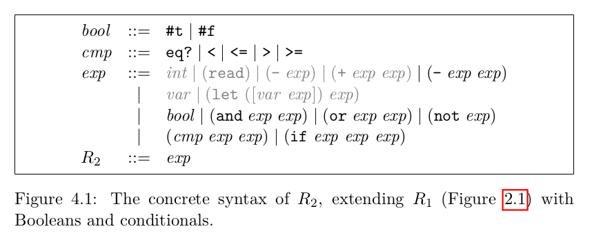
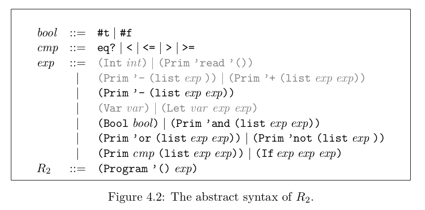

Rust One Piece | R2（一）

### 上一篇

R1 Plus

### R2 

EoC 第四章的内容，增加了布尔类型和 if 语句。第三章的着色器算法也会在 R2 的系列博客中介绍。这一节我们还是从 R2 的解释器开始。





### R2 解释器

首先是从语法上引入 Bool 类型及 if 语句。

```rs
// syntax.rs
#[derive(Debug, PartialEq, Eq, Clone, Hash)]
pub enum Expr {
    Int ( i64 ),
    Bool ( bool ),
    Var ( String ),
    Let ( Box<Expr>, Box<Expr>,  Box<Expr> ),
    If (Box<Expr>, Box<Expr>, Box<Expr>),
    Prim0 ( String ),
    Prim1 ( String, Box<Expr> ),
    Prim2 ( String, Box<Expr>, Box<Expr> ),
}
```

解释器增加对应的布尔运算语句。由于引入了 Bool 类型，解释器不能再像 R1 那样只返回 i64 了。现在我们要返回的类型同时也是一个 Expr。

```rs
fn interp_exp(expr: Expr, env: Rc<SymTable<String, Expr>>) -> Expr {
    match expr {
        Int(n) => Int(n),
        Bool(b) => Bool(b),
        Var(x) => env.lookup(&x).clone(),
        Prim0(op) if op.as_str() == "read" => Int(helper::readint()),
        Prim1(op, box e) => {
            match interp_exp(e, env) {
                Int(n) if op.as_str() == "-" => Int(-n),
                Bool(b) if op.as_str() == "not" => Bool(!b),
                _ => panic!("mismatch operator!"),
            }
        }
        Prim2(op, box e1, box e2) if helper::is_logical(op.as_str()) => {
            let e1 = interp_exp(e1, Rc::clone(&env));
            match op.as_str() {
                "and" => if e1 == Bool(false) { e1 } else { interp_exp(e2, env) }
                "or" => if e1 == Bool(true) { e1 } else { interp_exp(e2, env) }
                _ => panic!("unknown logical operator"),
            }
        }
        Prim2(op, box e1, box e2) => {
            match (interp_exp(e1, Rc::clone(&env)), interp_exp(e2, env)) {
                (Int(a), Int(b)) => {
                    match op.as_str() {
                        "+" => Int(a + b),
                        "-" => Int(a - b),
                        ">" => Bool(a > b),
                        "<" => Bool(a < b),
                        "<=" => Bool(a <= b),
                        ">=" => Bool(a >= b),
                        "eq?" => Bool(a == b),
                        _ => panic!("unknown operator"),
                    }
                }
                (_, _) => panic!("integer expected"),
            }
        }
        Let(box Var (x), box e1, box e2) => {
            let val = interp_exp(e1, Rc::clone(&env));
            let new_env: SymTable<String, Expr> = SymTable::extend(hashmap!(x => val), &env);
            return interp_exp(e2, Rc::new(new_env));
        } 
        If(box e, box e1, box e2) => 
            if interp_exp(e, Rc::clone(&env)) != Bool(false) { interp_exp(e1, env) } else { interp_exp(e2, env) },
        _ => panic!("bad syntax!"),
    }
}

fn interp_r2(expr: Expr) -> Expr {
    let env = Rc::new(SymTable::new());
    return interp_exp(expr, env);
}
```

值得一提的是， and 和 or 是短路运算，所以我们只求出 e1，根据 e1 的值来决定是否继续求 e2 。另一个是 if 语句。我的判断方法是 e 不为假 (false)，这意味着其他不是假的数据，如 Int(1) 都被视为真。

is_logical 的定义如下： 

```rs
pub fn is_logical(op: &str) -> bool {
    match op {
        "and" | "or" | "not" => true,
        _ => false,
    }
}
```

由于现在返回值不是 i64，而是 Expr，所以对应的测试用例也要改一下哦！

### parser

目前，parser 还并不支持 #t #f 这样的字面量，也不支持 if，所以要拓展一下。下面代码中新的语句已用注释标出。

```rs
pub fn parse_list(expr: &str) -> Sexpr {
    let mut stack = vec![];
    let mut sym = String::new();
    let mut list = vec![];
    for c in expr.chars() {
        match c {
            '(' => { 
                stack.push(list); 
                list = vec![];
            }
            '0'..='9' => sym.push(c),
            '+'|'-'|'*'|'/' => sym.push(c),
            '<'|'='|'>'|'?'|'#' => sym.push(c),         // 增加这一行
            'a'..='z'|'A'..='Z' => sym.push(c),
            ' ' => if !sym.is_empty() { list.push(Atom(sym)); sym = String::new(); }
            ')' => {
                if !sym.is_empty() { list.push(Atom(sym)); sym = String::new(); }
                let mut nlist = stack.pop().unwrap();
                nlist.push(List(list));
                list = nlist;
                sym.clear();
            }
            _ => (),
        }
    } 
    if !sym.is_empty() {
        return Atom(sym);
    } else {
        return list.pop().unwrap();
    }
}


pub fn parse_sexpr(sexpr: &Sexpr) -> Expr {
    match sexpr {
        Atom(s) => {
            if is_digit(s) { Int(s.parse().unwrap())} 
            else if s == "#t" { Bool(true) }
            else if s == "#f" { Bool(false) }
            else { Var(s.to_string()) } 
        }
        List(v) => match v.as_slice() {
            // let expression
            [Atom(op), List(bind), exp] if op == "let" => {
                match bind.as_slice() {
                    [Atom(var), val] if !is_digit(var) => {
                        Let( Box::new(Var(var.to_string())), Box::new(parse_sexpr(val)), Box::new(parse_sexpr(exp)) )
                    },
                    _ => panic!("variable could not be digit!"),
                }
            },
            // if expression
            [Atom(op), e, e1, e2] if op == "if"
                => If ( Box::new( parse_sexpr(e)), Box::new(parse_sexpr(e1)), Box::new(parse_sexpr(e2))),
            // prim
            [Atom(op), e1, e2] if is_arithmetic(op) || is_cmp(op) || is_logical(op)
                => Prim2 ( op.to_string(), Box::new( parse_sexpr(e1)), Box::new(parse_sexpr(e2))),
            [Atom(op), e] if is_arithmetic(op) || is_logical(op) 
                => Prim1 (op.to_string(), Box::new( parse_sexpr(e))),
            [Atom(op)] if op == "read" => Prim0 ( string!("read")),
            _ => panic!("Invalid syntax!"),
        }
    }
}
```

is_cmp 和 is_arithmetic 定义如下

```rs
// helper.rs
pub fn is_arithmetic(op: &str) -> bool {
    match op {
        "-" | "+" | "*" | "/" => true,
        _ => false,
    }
}

pub fn is_cmp(op: &str) -> bool {
    match op {
        "<=" | ">=" | "eq?" | "<" | ">" => true,
        _ => false,
    }
}
```

现在可以写个测试了！

```rs
#[test]
fn test_interp_r2_if2() {
    let e = "(if (not (if (and (let (x 10)
                            (let (y 32)
                                (eq? (+ x y) 42)))
                            #f)
                        #f #t))
                24 42)";
    let exp = parse(e);
    let res = interp_r2(exp);
    assert_eq!(res, Int(42));
}
```

### 结语

R2 解释器的内容就这些！R2 的许多代码与 R1 相比会有许多不同之处，有些小的地方我也会遗漏。如果读者有所疑惑，欢迎评论指出。