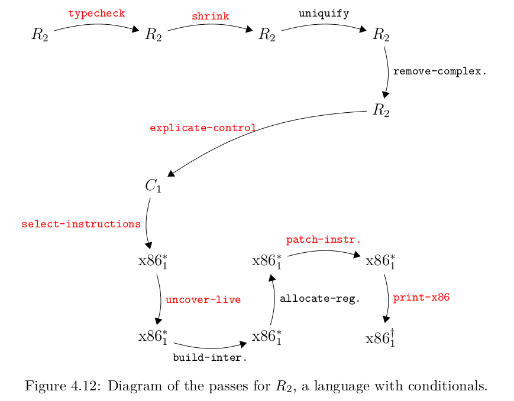

# Rust One Piece | R2（二）

### R2 编译器



图中红色部分为新增或者需要修改的 pass 。

### type_checker

R2 的第一个 pass 是类型检查。类型检查可以看成是一个解释器，输入是语句，返回是类型。如果发生类型错误，则报错。Eoc 提供了 type-checker 的框架，可以参考参考。

我用一个单独的模块`typesystem.rs`来完成这个 pass 。

目前，我们只有整形和布尔型，有

```rs
use crate::*;
use std::hash::Hash;

#[derive(PartialEq, Eq, Hash, Clone, Debug)]
pub enum RType {
    Integer,
    Boolean,
}

use RType::*;
```


type-checker 的主体跟解释器很相似。我们同样使用了一个符号表，存储的是变量的类型。当遇到 let 时，就把变量的类型放进符号表，然后求 body 的类型。

遇到 if，则确认它的第一个表达式一定是布尔类型。布尔操作符的结果是布尔型，整型操作符的结果是整型。 

```rs
pub fn type_checker(expr: &Expr) -> RType {
    let env = Rc::new(SymTable::new());
    type_checker_expr(expr, env)
}

fn type_checker_expr(expr: &Expr, env: Rc<SymTable<String, RType>>) -> RType {
    match expr {
        Int(n) => Integer,
        Bool(b) => Boolean,
        Var(x) => env.lookup(x).clone(),
        Let(box Var(x), box e, box body) => {
            let etype = type_checker_expr(e, Rc::clone(&env));
            let new_env = SymTable::extend(hashmap!(x.to_string() => etype), &env);
            type_checker_expr(body, Rc::new(new_env))
        }
        If(box e, box e1, box e2) => {
            let etype = type_checker_expr(e, Rc::clone(&env));
            assert!(Boolean == etype);
            if e == &Bool(true) { type_checker_expr(e1, env) } else { type_checker_expr(e2, env) }
        }
        Prim0(op) if op.as_str() == "read" => Integer,
        Prim1(op, box e) => {
            let etype = type_checker_expr(e, env);
            match op.as_str() {
                "-" => assert!(Integer == etype),
                "not" => assert!(Boolean == etype),
                _ => panic!("unknown Prim1 operator"),
            };
            etype
        }
        Prim2(op, box e1, box e2) => {
            let e1type = type_checker_expr(e1, Rc::clone(&env));
            let e2type = type_checker_expr(e2, env);
            match op.as_str() {
                "and" | "or" => { 
                    assert!(Boolean == e1type); 
                    assert!(Boolean == e2type);
                    Boolean
                }
                ">" | "<" | "<=" | ">=" | "eq?" => {
                    assert!(Integer == e1type);
                    assert!(Integer == e2type);
                    Boolean
                }
                "+" | "-" => {
                    assert!(Integer == e1type);
                    assert!(Integer == e2type);
                    Integer
                }
                _ => panic!("unknown Prim2 operator"),
            }
        }
        _ => unreachable!(),
    }
}
```


测试一下！

```rs
#[test]
#[should_panic]
fn test_type_checker2() {
    let exp = "(if (not 1) #t #f)";
    let exp = parse(exp);
    let etype = type_checker(&exp);
}
#[test]
fn test_type_checker3() {
    let exp = "(and (> 10 20) (eq? 10 42))";
    let exp = parse(exp);
    let etype = type_checker(&exp);
    assert_eq!(etype, Boolean);
}
```

记得用`mod`和`use`引入相应的模块哦！

### shrink

shrink 意指缩减。R2 引入了很多操作符: `and or eq? <= >=`等等。其中，有一些可以用另外的操作符组合得到，

如果提前处理掉这些操作符，后面的代码就不需要处理这些了。当然，这也有可能失去优化的机会，所以这是一个 tradeoff。

我们要优化掉的操作符有

```rs
(and x y) => (if (not x) x y))
(or x y) => (if x x y)
(<= x y) => (not (< y x)
(> x y) => (< y x)
(>= x y) => (not (< x y))
(- x y) => (+ x (- y))
```

为了确保执行顺序，我们需要用 let 语句把 x 缓存起来。

```rs
pub fn shrink(expr: Expr) -> Expr {
    match expr {
        Prim2(op, box e1, box e2) => {
            match op.as_str() {
                "-" => Prim2("+".to_string(), Box::new(e1), Box::new(Prim1("-".to_string(), Box::new(e2)))),
                "or" => {
                    let x = Var(gensym());
                    Let(Box::new(x.clone()), Box::new(e1),
                        Box::new(If(Box::new(x.clone()), Box::new(x), Box::new(e2))))
                }
                "and" => {
                    let x = Var(gensym());
                    Let(Box::new(x.clone()), Box::new(e1),
                        Box::new(If(Box::new(Prim1("not".to_string(), Box::new(x.clone()))), Box::new(x), Box::new(e2))))
                }
                ">=" => { // (not (< e1 e2))
                    let x = Var(gensym());
                    Let(Box::new(x.clone()), Box::new(e1),
                        Box::new(Prim1("not".to_string(), Box::new(Prim2("<".to_string(), Box::new(x), Box::new(e2))))))
                }
                "<=" => { // (not (< e2 e1)
                    let x = Var(gensym());
                    Let(Box::new(x.clone()), Box::new(e1),
                        Box::new(Prim1("not".to_string(), Box::new(Prim2("<".to_string(), Box::new(e2), Box::new(x))))))
                }
                ">" => { // (< e2 e1)
                    let x = Var(gensym());
                    Let(Box::new(x.clone()), Box::new(e1),
                        Box::new(Prim2("<".to_string(), Box::new(e2), Box::new(x))))
                }
                _ => Prim2(op, Box::new(shrink(e1)), Box::new(shrink(e2)))
            }
        }
        Let(x, box e, box body) => {
            Let(x, Box::new(shrink(e)), Box::new(shrink(body)))
        }
        If(box e, box e2, box e3) => {
            If(Box::new(shrink(e)), Box::new(shrink(e2)), Box::new(shrink(e3)))
        }
        e => e
    }
}
```

写个测试

```rs
#[test]
fn test_shrink2() {
    fn helper(e: &str, expect: Expr) {
        let exp = parse(e);
        let exp = shrink(exp);
        let res = interp_r2(exp);
        assert_eq!(res, expect);
    }
    helper("(>= 3 3)", Bool(true));
    helper("(or #f #t", Bool(true));
    helper("(and #t #t", Bool(true));
    helper("(- 10 30)", Int(-20));
    helper("(<= 4 3)", Bool(false));
    helper("(and (> 10 20) (eq? 10 42))", Bool(false));
}
```

### 结语

这是两个新的简单的 pass，放一起方便掌握，嘻嘻！这里完成的是 R2 -> R2 的 pass。