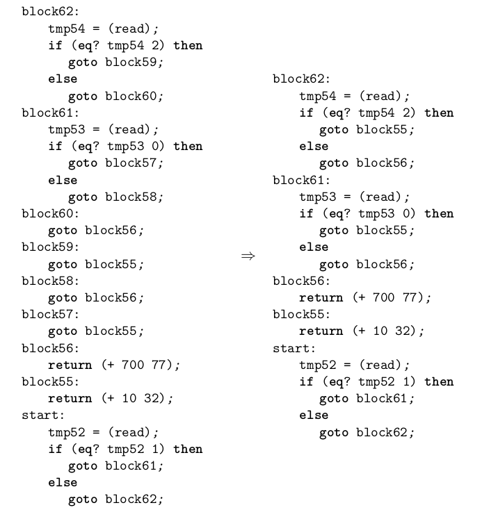

# Rust One Piece | R2（四）

上一节，我们从 Expr 编译到了 C0。但我们对 If 语句的处理还不够好。如编译以下程序，

```lisp
(if (if (eq? (read) 1)
        (eq? (read) 0)
        (eq? (read) 2))
    (+ 10 32)
    (+ 700 77))
```

它会生成许多只包括一个 Goto 语句的代码块。这一节我们将写一个 pass，optimize-jumps，来优化掉这些不必要的块。下面的左边是上一个 pass 的输出，右边是这个 pass 的输出。



### optimize-jumps

优化的思路是，首先遍历所有的 block 中的全部 Goto 语句，看看这些 Goto 语句所跳往的 block 是不是一个只含有一个 Goto 语句的 trivial block，如果是，则直接跳往下一个 block，直到所跳往的 block 不是 trivial block。

我们需要一个哈希表，键是 Goto(lab) 中的 lab，值是从 lab 出发遇到的第一个 nontrivial block。也就是说，那些跳往键的 Goto，要改成跳往值。

```rs
// compiler.rs
fn get_shortcut(prog: &C0Program) -> HashMap<String, String> {
    // 跳往 key 的人，应该跳往 value
    let mut shortcut = HashMap::new();
    for (label, code) in &prog.cfg {
        if let C0::Goto(ref lab) = &code {
            let mut target = lab.clone();
            while let C0::Goto(ref lab_) = &prog.cfg.get(&target).unwrap() {
                target = lab_.to_string();
            }
            shortcut.insert(label.clone(), target);
        } 
    }
    return shortcut;
}
```

由 get_shortcut，我们得到了所有 trivial block （key） 所指向的 nontrivial block （value）。下面我们只需要按这个表来更新代码，并把 trivial block 丢弃就好了。

```rs
pub fn optimize_jumps(mut prog: C0Program) -> C0Program {
    use C0::*;
    let shortcut = get_shortcut(&prog);
    let C0Program { cfg, locals } = prog;
    let mut new_cfg = HashMap::new();
    for (label, code) in cfg.into_iter() {
        let code = optimize_jumps_helper(&label, code, &shortcut);
        // now, code should not be Just Goto!
        if label.as_str() == "start" || mem::discriminant(&code) != mem::discriminant(&Goto(String::new())) {
            new_cfg.insert(label, code);
        }
    }
    C0Program { cfg: new_cfg, locals }
}
```

`optimize_jumps` 的 for 循环中，用辅助函数更新了代码，用 if 语句过滤了那些只有 Goto 的块。现在我们可以实现辅助函数了。

```rs
fn optimize_jumps_helper(label: &String, code: C0, shortcut: &HashMap<String, String>) -> C0 {
    use C0::*;
    match code {
        Seq(box assign, box tail) => {
            let tail = optimize_jumps_helper(label, tail, shortcut);
            let seq = Seq(Box::new(assign), Box::new(tail));
            return seq;
        },
        Goto(lab) => match shortcut.get(&lab) {         // 这里更新 label
            None => Goto(lab),
            Some(lab_) => Goto(lab_.to_string()),
        },
        If(box c, box e1, box e2) => {
            If(Box::new(c), Box::new(optimize_jumps_helper(label, e1, shortcut)),
                            Box::new(optimize_jumps_helper(label, e2, shortcut)))
        },
        e => e,
    }    
}
```

写个简单的测试

```rs
#[test]
fn test_optimize_jump() {
    let e = "(if (if #f #t #f) #t #f)"; 
    let expr = parse(e);
    let expr = remove_complex_opera(expr);
    let expr = explicate_control(expr);
    assert_eq!(5, expr.cfg.len());
    let expr = optimize_jumps(expr);
    assert_eq!(3, expr.cfg.len());
}
```


### 结语

这一节，我们把没用的 block 优化掉了。但是，在我们的测试用例中，有一个块是既不是`start`，也没有前驱，也就是是，它是一个孤立的块。这在 EoC 第四章中似乎没有提及。要移除这样的 dead code，只要多遍历一次就可以，这是我能想到的笨方法。

在下一节，我们将实现 EoC 第三章的图着色算法。受限于我的时间和精力，第四章剩下的所有 pass 的修改，都不再繁述。虽然如此，但它们都很简单。如果你是一步一步从 R0 走过来的，相信一看代码就懂的！

