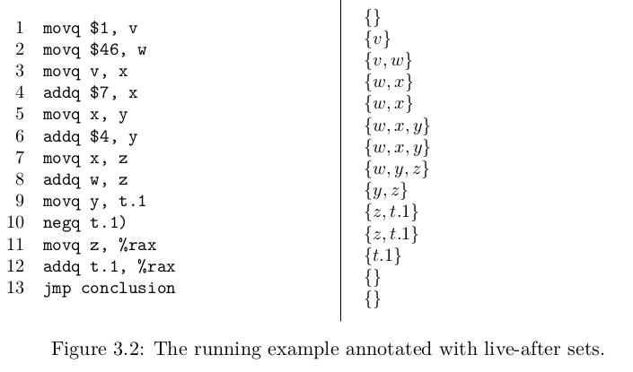
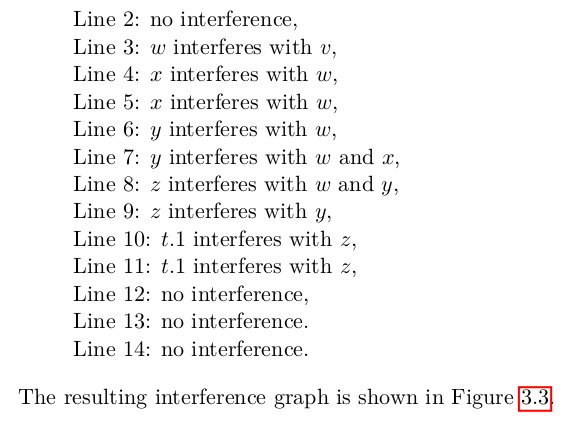
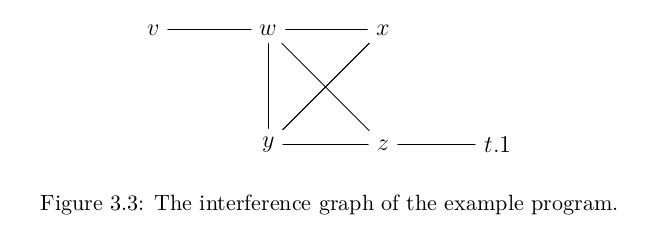

# Rust One Piece | R2（五） 寄存器分配

这一节对应 EoC 第三章的内容，同时也包含了第四章中的改进部分。目标是写一个寄存器分配的算法。寄存器分配有很多算法，Eoc 用的是图着色算法。在上一节，我们从 C1 编译到了 x86。现在，我们将为 x86 中的变量分配寄存器。

### Liveness Analysis

姑且叫存活分析吧。指的是在执行某一个汇编指令时，有哪些变量是存活的。（A variable is live if the variable is used at some later point in the program
and there is not an intervening assignment to the variable. ）

书中的例子

```rs
movq $5, a
movq $30, b
movq a, c
movq $10, b
addq b, c
```

问 a, b 是同时存活的吗？ (Are a and b both live at the same time?)

答案是否定的。b 在第二行的值被第四行的覆盖了，所以 a，b 实际上并没有同时存活。a 存活于 1-3 行，b 存活于 4-5 行。

一个变量是否存活，是可以计算出来的。设 $L_{after}(k)$ 是执行指令 $I_k$ 之后存活的变量集，则有

$$ L_{after}(k-1) = (L_{after}(k) - W(k)) \cup R(k) $$

其中，$W(k)$ 是 $I_k$ 所写的变量集合。$R(k)$ 是 $I_k$ 所读的变量集合。

还是用上面的例子。我们跟着书一起分析

第 5 行（最后一行）

```rs
addq b, c 
```

则指令的存活集为空（程序最后一行的指令集当然都是空）

```rs
after_5 = {} 
```

由于这个指令所读的是 b、c，所写的是 c。所以

```rs
W_5 = {c}
R_5 = {b, c}
```

现在我们可以得到第 4 行的 $L_{after}$

```rs
after_4 = (after_5 - W_5) U R_5 = {b, c}
```

然后，看到第 4 行指令

```rs
movq $10, b
```

它的读写集分别为

```rs
R_4 = {}
W_4 = {b}
```

可以计算第 3 行的存活集 $L_{after}$

```rs
after_3 = (after_4 - W_4) U R_4 = {c}
```

这个过程反复进行，可以得到

```rs
after_5 = {}
after_4 = {b, c}
after_3 = {c}
after_2 = {a}
after_1 = {a}
```

思路厘清之后，可以写代码了

```rs
pub fn uncover_live<'a>(instructions: &'a Vec<x86>, mut after: HashSet<&'a x86>) -> Vec<HashSet<&'a x86>> {
    let mut liveset = vec![];
    for code in instructions.iter().rev() {
        let (read, write) = compute_RW(&code);
        let mut before: HashSet<&x86> = after.difference(&write).cloned().collect();
        before = before.union(&read).cloned().collect();
        liveset.push(after);
        after = before;
    }
    let liveset = liveset.into_iter().rev().collect();
    return liveset;
}
```

这里我们第一次遇到了 Rust 的 lifetime。因为存活分析时，我们需要用集合来记录存活变量，但我又不想大量拷贝，所以集合里存活的是变量的引用。在上面的代码中，由于这些变量的引用跟变量的生命周期是一致的，所以我们声明它们都是在 a 这个生命周期中。

代码主体部分，我从后面遍历指令。每处理一个指令时，先计算出它的 R，W 集合。然后减去 W，合并 R，得到 before。before 也就是前一个指令的 after 啦。

看看 R，W 是如何计算的

```rs
fn compute_RW(code: &x86) -> (HashSet<&x86>, HashSet<&x86>) {
    use x86::*;
    let mut read = HashSet::new();
    let mut write = HashSet::new();
    match code {
        Op1(op, box e) => {
            match op.as_str() {
                "negq" =>  if is_var(e)  { read.insert(e); write.insert(e); } 
                _ => unreachable!(),
            }
        },
        Op2(op, box e1, box e2) => {
            match op.as_str() {
                "addq" | "xorq" => {
                    if is_var(e1) { read.insert(e1); }
                    if is_var(e2) { read.insert(e2); write.insert(e2); } 
                },
                "movq" | "movzbq" => {
                    if is_var(e1) { read.insert(e1); }
                    if is_var(e2) { write.insert(e2); }
                },
                "cmpq" => {
                    if is_var(e1) { read.insert(e1); }
                    if is_var(e2) { read.insert(e2); }
                }
                _ => unreachable!(),
            }
        }
        _ => ()
    }
    return (read, write);
}

fn is_var(expr: &x86) -> bool {
    let any = x86::Var(String::new());
    mem::discriminant(expr) == mem::discriminant(&any)
}
```

写个测试

```rs
#[test]
fn test_uncover_live() {
    use x86::*;
    let exp = "(let (a 5)
               (let (b 30)
               (let (c a)
               (let (b 10)
               (let (c (+ b c))
                   c)))))";
    let exp = parse(exp);
    let exp = remove_complex_opera(exp);
    let exp = explicate_control(exp);
    let block = select_instruction(exp);
    let x86Program {mut cfg, stack_space, locals } = block;
    let instructions = cfg.get(&"start".to_string()).unwrap();
    let liveset = uncover_live(instructions, HashSet::new());
    let a = Var("a".to_string());
    let b = Var("b".to_string());
    let c = Var("c".to_string());
    let expect = vec![
        hashset!(&a), hashset!(&a), hashset!(&c), hashset!(&c, &b),
        hashset!(&c), hashset!(), hashset!(), 
    ];
    assert_eq!(expect, liveset);
}
```


在`uncover_live`的参数中，有一个 after 。在 EoC 的第三章，由于只有一个代码块，所以 after 总是为空集。但是在第四章，有多个代码块，after 就不一定为空了。这时候， after 为其一个或多个后继代码块的第一条指令的 after 的并集。

也就是说，我们需要分析代码块之间的关系，以明确其执行的顺序。有了顺序，自然就可以计算出前驱或者后缀代码块。拓扑排序可以做到这一点。关于拓扑排序，这篇[博客](https://blog.csdn.net/lisonglisonglisong/article/details/45543451)写得很清晰。我参考作者的写法，写了一个 tsort.rs 模块。在本节中，我们把 tsort 当成一个内置函数来使用。tsort 的函数签名如下

```rs
pub fn tsort(nodes: usize, edges: Vec<(usize, usize)>) -> Vec<usize>
```
nodes 是一个数字，代表图中的节点数。edges 是边集，每一个 edge 是一个元组 e 。方向从 e.0 指向 e.1 。由于这个算法是用数字表示节点的，所以要调用这个函数，我们也需要做一个编码。

```rs
use crate::tsort;
pub fn uncover_live_prog(prog: &x86Program) -> HashMap<String, Vec<HashSet<&x86>>> {
    use x86::*;
    let cfg = &prog.cfg;
    let mapping:     HashMap<usize, &String> = cfg.keys().enumerate().collect();
    let mapping_rev: HashMap<&String, usize> = cfg.keys().zip(0..).collect();
    // ...
} 
```

我先对标签做了映射。这样，就可以用数字来表示代码块了。接着，我们获取边与代码块的后继关系。

```rs
pub fn uncover_live_prog(prog: &x86Program) -> HashMap<String, Vec<HashSet<&x86>>> {
    // ...
    // 获取边和后继关系
    let mut successors = HashMap::new();
    let mut edges = vec![];
    for (label, instructions) in cfg {
        for instr in instructions.iter() {
            match instr {
                Jmp(label_) | Jmpif(_, label_) if label_.as_str() != "conclusion" => {
                    let from = *mapping_rev.get(label).unwrap();
                    let to = *mapping_rev.get(label_).unwrap();
                    edges.push( (from, to) );
                    // successors
                    let mut suc = successors.entry(from).or_insert(HashSet::new());
                    suc.insert(to);
                }
                _ => (),
            }
        }
    }
} 
```

现在我们可以计算拓扑顺序，但是要进行存活分析，我们需要的是反拓扑顺序。

```rs
    // ...
    let tsort_order = tsort::tsort(cfg.len(), edges);
    let order = tsort_order.into_iter().rev();
    // ...
```

接下来，按顺序计算每个代码块的存活集。其实就是对每一个代码块都`uncover_live`函数。不同的时，我们需要获取这个代码块的后继，并计算出初始的 after 。

```rs
    // now we can deal with liveset with every block
    let mut livesets = HashMap::new();
    for id in order {
        let label = *mapping.get(&id).unwrap();
        let instructions = cfg.get(label).unwrap();
        // what we need is merge successors live after set
        let mut after: HashSet<&x86> = HashSet::new();
        if let Some(set) = successors.get(&id) {
            for successor_id in set {
                let set_: &Vec<HashSet<&x86>> = livesets.get(successor_id).unwrap();
                after = after.union(&set_[0]).cloned().collect();
            }
        }
        let liveset = uncover_live(instructions, after);
        livesets.insert(id, liveset);
    }
```

最后的最后，我们把每个代码块的存活集放在一个字典里返回。

```rs
// ...
    let mut final_liveset = HashMap::new();
    for (id, liveset) in livesets {
        let label = mapping.get(&id).unwrap().clone().clone();
        final_liveset.insert(label, liveset);
    }
    return final_liveset;
// ...
```

至此，存活分析完成。

### Building the Interference Graph

An interference graph is an undirected graph that has an edge between two variables if they are live at the same time, that is, if they interfere with each other.

Interference Graph 网译为冲突图。它是一个图结构，每个变量是一个结点，结点的连线表示这两个变量是冲突的。也就是它们不能使用同一个寄存器。上一节的存活分析就是为了在这一节建冲突图。

书中提出以下三条规则：

+ 如果指令 $I_k$ 是一个算术指令，如 `addq s, d`，则对于每一个 $v \in L_{after}(k)\ unless\ v = d$，添加边 (d, v)
+ 如果指令 $I_k$ 是一个 `movq s, d` 语句，则对于每一个 $v \in L_{after}(k)\ unless\ v = d \ or \ v = s$，添加边 (d, v)
+ 如果指令 $I_k$ 是一个 callq 语句，则对于每一个 called-saved 寄存器 r 和每一个 $v \in L_{after}(k)$，添加边 (r, v)

这是出自编译器书籍虎书的方法。

现在我们看个例子



注意左边是 13 行代码，右边有 14 个 存活集。第一个存活集是一个 before，目前可以忽略掉的。现在我们第二个存活集开始，列出变量之间的冲突关系。只要同处一个存活集的变量就是冲突的。



于是可以作图



这样，冲突关系图就得到了。接下来是给它们分配寄存器。这一部分书中讲得很详细，看书就好了。简单讲就是

+ 找出最饱和的一个结点
+ 给这个结点选一个合适的颜色，一般是数值最小的那个
+ 更新周围结点的饱和集
+ 重复上面过程直到所有结点都已上色

这就是所谓图着色算法。

这里的代码很多，而且实现也不美观，所以我只简单说一下我的思路，供有兴趣的同行参考，也请那些真正懂的人来分享他们的优雅做法。

首先是定义图结构

```rs
pub struct Graph {
    nodes: HashSet<x86>,                        // 图中节点
    move_related: HashMap<x86, x86>,            // 相互转移关系
    adjacent: HashMap<x86, HashSet<x86>>,       // 邻接表
    saturation: HashMap<x86, HashSet<i8>>,      // 每个节点的饱和度
    colors: HashMap<x86, i8>                    // 每个节点的颜色
}
```

其次是图着色算法主体

```rs
impl Graph {
    pub fn colorize(&mut self) {
        while self.nodes.len() > 0 {
            let t = self.most_saturation();     // 选出饱和度最高的节点
            self.nodes.remove(&t);              // 从未着色节点的集合中删除之
            let color = self.select_color(&t);  // 为该节点选择颜色
            self.update_saturation(&t, color);  // 更新邻接节点的饱和度
            self.colors.insert(t, color);       // 为该节点着色
        }
    }
}
```

其他的如遍历代码及存活集，往冲突图中添加边的操作，可以参考我写的代码。如果读者的实现更加优雅，希望能不吝赐教。

### spill register

当上一节完成的时候，Graph 中的 colors 字段就可以指导后续的寄存器分配了。如果寄存器不够用，就分配到栈上。

### color_graph

图着色算法的主函数，输入为 x86Program，输出为一个 Map，键为变量，值为寄存器或者 Deref，一个 usize 表示有多少个变量是被分配到了栈上。

```rs
fn color_graph(block: &x86Program) -> (HashMap<x86, x86>, usize) {
    let livesets = uncover_live_prog(&block);
    let mut graph = build_interference(block, livesets);
    graph.colorize();
    let colormap = graph.colors;
    spill_register(colormap) 
}
```

### allocate_registers

这个函数的功能是把所有变量中的变量都换成对应的寄存器或者 Deref，至此寄存器分配完成了。

```rs
const BYTE: usize = 8;
const FRAME: usize = 16;
pub fn allocate_registers(block: x86Program) -> x86Program {
    use x86::*;
    let (homesmap, n) = color_graph(&block);

    let x86Program { cfg, stack_space, locals } = block;
    let stack_space = align_address(n * BYTE, FRAME);

    fn helper(expr: x86, homesmap: &HashMap<x86, x86>) -> x86 {
        match expr {
            Var(x)  => homesmap.get(&Var(x)).unwrap().clone(),
            Op1(op, box e) => Op1(op, Box::new(helper(e, homesmap))),
            Op2(op, box e1, box e2) => Op2(op, Box::new(helper(e1, homesmap)), Box::new(helper(e2, homesmap))),
            e => e,
        }
    }
    let mut new_cfg = HashMap::new();
    for (label, mut codes) in cfg {
        codes = codes.into_iter().map(|code| helper(code, &homesmap)).collect(); 
        new_cfg.insert(label, codes);
    }
    x86Program { cfg: new_cfg, locals, stack_space }
}
```

### 结语

这一节我们学习了寄存器分配算法中的图着色算法。我忽略掉了更多代码解释，是因为我相信如果读者也是一行行代码自己写下来，是不需要太多解释的。这些代码希望可以起到一个沟通交流的作用。因为我也是学生呀！一起学习！