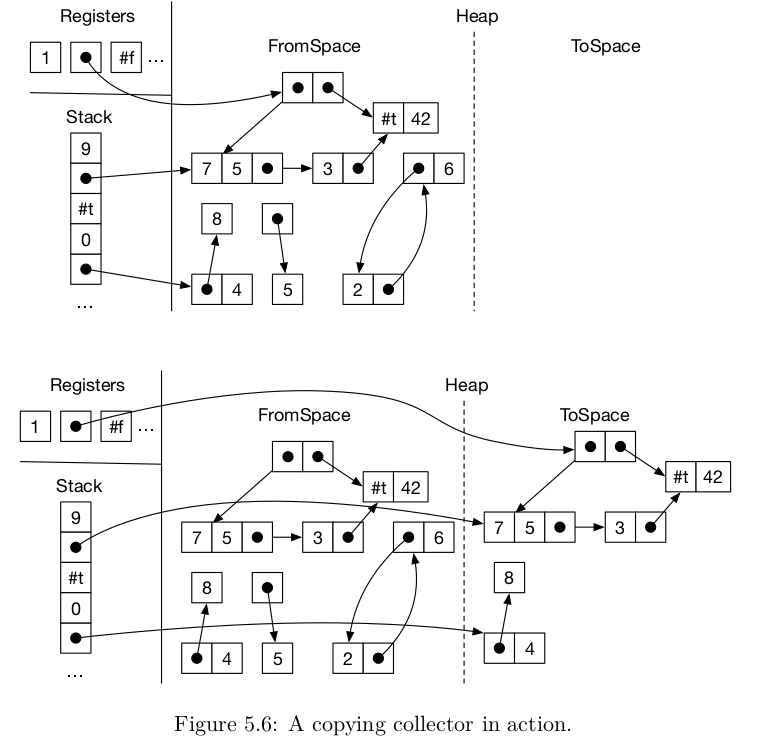

# Rust One Piece | R3（二） 垃圾回收

承上一节，我们需要对引用类型进行回收。这一部分，非常建议多读几遍原文。

### 原理

EoC 采用的是 two-space copying collector。粗略来讲，这个 GC 准备了两个一样大的内存空间，叫做 fromspace 和 tospace 。当 fromspace 不足以分配新的对象的时候，就把 fromspace 中所有有效的数据全部复制到 tospace 中去。然后 tospace 变成了新的 fromspace，fromspace 变成新的 tospace，不断地循环。这个算法思想真是简单粗暴啊！

换另一种表述法：你有一个空房间，你不停地买东西放进去。有一天，满了。你想，我要换个房间了，所以你把房间的东西一件件搬过去。当然，你只搬你想要的东西。不想要的就留在房间里不管了。

所以，这个 GC 有几个特点：一是非常耗内存；二是，它分配空间速度很快，内存连续；三是，它进行垃圾回收的时候，垃圾再多也不影响它的回收速度；四是，它回收的时候，速度很慢。




可以看到，图中有效的元素被复制到了 tospace 。

### 数据表示

具体实现之前，需要先明确我们的数据在内存中要怎么表示，比如怎么区分普通数据跟指针数据。EoC 5.2.2 节专门讲这个。书中采用两种方式来表示数据类型

+ 对于非向量类型，把数据存放在栈上。对于向量类型，把数据存放在堆上
+ 由于向量中也可能会有非向量类型，所以用一个额外的 tag 来存储相关的信息

tag 是一个 64 位整型。它的结构如下：

```sh
63    57 | 56         7 | 6    1 | 0
---------------------------------------
no use   | pointer mask | length | flag
```

+ flag 标志。1 表示这个向量还没有被复制到 tospace 中去
+ length 长度。规定 vector 的最大长度为 50，所以 6 位的长度是足够的
+ pointer mask。共 50 位，1 表示向量，0 表示非向量

此外，我们维护一个栈来保存向量类型的指针（而不是普通的程序调用栈），称之为 rootstack，它保存的是当前所有可以直接访问的向量地址。


原理的部分粗略说明到此为止。原文提供了非常详细的图解过程，可以多读几遍。剩下的内容是关于 runtime.c 的，喜欢研究细节的读者可能会感兴趣。我为了教会自己，所以跟着 runtime.c 写了一遍代码并注释，供读者参考。

### 代码

这是我写的代码
```rust
runtime.c      : 98
runtime.h      : 13
---------------------
total          : 111
```

这是官方提供的
```rust
runtime.c      : 443
runtime.h      : 18
---------------------
total          : 461
```

为了简单起见，我做了许多简化；为了安全起见，请使用官方版的 :)


我们先准备好头文件，解说已经在注释中了。

```C++
#include <stdint.h>

// fromspace 代表的是程序可用的 heap。如果这个 heap 不够用了，就启动垃圾收集
// 把 fromspace 中的还有用的变量全部拷贝到 tospace
// tospace 跟 fromspace 应该一样大
int64_t* fromspace_begin;
int64_t* fromspace_end;

int64_t* tospace_begin;
int64_t* tospace_end;

// free_ptr 一直指向下一个空闲的内存位置
int64_t* free_ptr;

// rootstack 是引用类型的栈。它是一个指针数组。数组的指针指向当前 heap 中的元素
// 在回收时，只有在这个栈的引用类型才会被复制到 tospace。
// 提示：int* 是一个指向整型的指针，int** 是一个指向整型指针的指针
int64_t** rootstack_begin;
int64_t** rootstack_end;

void initialize(uint64_t rootstack_size, uint64_t heap_size);
void collect(int64_t** rootstack_ptr, uint64_t bytes_requested);
void copy_vector(int64_t** vector_ptr_loc);
void cheney(int64_t** rootstack_ptr);

int64_t read_int();
```

现在，我们要依次解决四个函数。

首先，是初始化我们两个 heap 和一个 rootstack，需要指定它们的大小并分配内存，把指针放在合适的位置上。

```C++
// 初始化程序的堆和栈
void initialize(uint64_t rootstack_size, uint64_t heap_size) 
{
    // 1. check
    assert(sizeof(int64_t) == sizeof(int64_t*));
    assert((heap_size % sizeof(int64_t)) == 0);
    assert((rootstack_size % sizeof(int64_t)) == 0);

    // 2. allocate
    fromspace_begin = malloc(heap_size);
    fromspace_end = fromspace_begin + heap_size / sizeof(int64_t);
    
    tospace_begin = malloc(heap_size);
    tospace_end = tospace_end + heap_size / sizeof(int64_t);

    rootstack_begin = malloc(rootstack_size);
    rootstack_end = rootstack_begin + rootstack_size / sizeof(int64_t);

    // check all
    assert(fromspace_begin && tospace_begin && rootstack_begin);

    // 3. init
    free_ptr = fromspace_begin;
}
```

堆和栈以及它们的指针就绪了。程序运行的过程中，free_ptr 会随着向量的分配而移动。当 fromspace 的剩余空间不够用的时候，我们就开始回收工作。粗略地说，collect 需要一个 rootstack 的栈顶指针和要求分配的空间大小。它首先把数据移到 tospace 空间。然后检查下有没有足够的空间，如果有，则工作完成。否则说明当前的 heap 太小了。所以先对 heap 的大小进行倍增，直到能够分配新的对象。注意这时候要同时更新 fromspace 和 tospace 的大小。这一部分细节看代码及注释。

```C++
void collect(int64_t** rootstack_ptr, uint64_t bytes_requested)
{
    // 1. 先进行回收，cheney 把 fromspace 的有效引用全部复制到了 tospace，并交换了
    //    tospace 和 fromspace 的空间。也就是说，内容仍然在（新的） fromspace 中。
    cheney(rootstack_ptr);

    // 2. 看看是否有足够的空间来分配新的对象，如果没有，则需要扩大 heap 的空间
    if (sizeof(int64_t) * (fromspace_end - free_ptr) < bytes_requested) {
        printf("COLLECT: no enough room, enlarger the heap\n");
        
        unsigned long occupied_bytes = (free_ptr - fromspace_begin) * sizeof(int64_t);
        unsigned long needed_bytes = occupied_bytes + bytes_requested;
        unsigned long old_len = fromspace_end - fromspace_begin;
        unsigned long old_bytes = old_len * sizeof(int64_t);

        // 一直翻倍，直到超过 needed_bytes
        unsigned long new_bytes = old_bytes;
        while (new_bytes <= needed_bytes) {
            new_bytes *= 2;
        }

        // 现在，我们需要把旧的 tospace 释放掉，同时分配一个新的 tospace。然后，用 cheney 
        // 把数据拷贝到 tospace 来。注意，tospace 和 fromspace 又交换了。这时，fromspace
        // 比 tospace 要大，需要把 tospace 释放掉，分配一个新的。
        free(tospace_begin);
        tospace_begin = malloc(new_bytes);
        tospace_end = tospace_begin + new_bytes / sizeof(int64_t);
        assert(!tospace_begin);

        cheney(rootstack_ptr);

        free(tospace_begin);
        tospace_begin = malloc(new_bytes);
        tospace_end = tospace_begin + new_bytes / sizeof(int64_t);
    }
}
```

collect 的工作流程清楚了。cheney 函数的功能是进行数据的迁移，这是算法的核心部分。

```C++
// cheney 算法的作用是，把 fromspace 的有效引用全都复制到 tospace。然后把栈上的指针重新指向
// tospace 的内容。最后，交换两个堆的指针。
void cheney(int64_t** rootstack_ptr)
{
    // 要在 tospace 分配内存，所以 free_ptr 需要调整到开始位置
    free_ptr = tospace_begin;

    // 首先把 rootstack 上的东西转移过去。copy_vector 会检查这个 vector 是否已经复制
    // 如果已经复制了，就把 cur 指向新的向量。如果没有，就先复制过去，再修改 cur 的值
    // -----------------------------------------------------------
    // p1* | p2* | p3* | ... | ...  | pn* | ...  
    // ^                               ^
    // cur  -> ->  -> 
    // begin                          ptr                   end 
    for (int64_t** cur = rootstack_begin; cur != rootstack_ptr; cur++) {
        copy_vector(cur);
    }

    // 现在，rootstack 上的内容全都在 tospace 中了，我们从左往右扫每一个节点，直到
    // 到达 free_ptr 的位置。free_ptr 不一定在 tospace 的开始位置了。因为复制过程
    // 会移动 free_ptr 指针
    int64_t* scan_ptr = tospace_begin;
    while (scan_ptr != free_ptr) {

        // tag 总是在 vector 的第一个位置
        int64_t tag = *scan_ptr;

        // 长度位于 tag 的第 1-6 个位
        int len = (tag >> 1) & 0b111111;

        // 算出下一个要处理的向量
        int64_t* next_ptr = scan_ptr + len + 1;

        // 取出 pointer mask，它提示我们当前这个向量中的数据类型
        int64_t mask = tag >> 7;
        
        // 扫一遍这些元素，如果是一个向量，则复制到 tospace
        scan_ptr += 1;
        while (scan_ptr != next_ptr) {
            if ((mask & 1) == 1) {
                // mask 为 1，说明 scan_ptr 所指向的内容是一个向量指针，所以呢，我们把
                // scan_ptr 转为指针的指针，用 copy_vector 进行复制
                copy_vector((int64_t**)scan_ptr);
            }
            mask = mask >> 1;
            scan_ptr += 1;
        }
        // scan_ptr 到达 next_ptr 时，对第一个元素的处理就结束了，开始处理下一个元素了。
    }
    // 来到这里，scan_ptr 跟 free_ptr 相遇，垃圾收集完毕。
    // 现在要交换两个空间了。
    int64_t* tmp_begin = tospace_begin;
    int64_t* tmp_end = tospace_end;
    tospace_begin = fromspace_begin;
    tospace_end = fromspace_end;
    fromspace_begin = tmp_begin;
    fromspace_end = tmp_end;
}
```

最后，关于 tag 的细节，包含在 copy_vector 中。

```C++
// copy_vector 接受一个指向向量指针的指针，把它所指向的向量复制到 tospace 中，并把这个指针
// 指向复制出来的那个向量
// 提示： *vector_ptr_loc 指的是一个指向向量的指针
//      **vector_ptr_loc 指的是真正的向量
void copy_vector(int64_t** vector_ptr_loc)
{
    int64_t* old_vector_ptr = *vector_ptr_loc;
    // 由于向量都是 8 字节对齐的，所以向量指针的最后 3 位总会是 0
    // 利用这一点，我们可以设置标记。因为我们要能够分辨这个指针是否已被处理过了。
    // 首先，取出标志位
    int old_tag = (int64_t)old_vector_ptr & 0b111;
    
    // 现在，我们规定 vector 类型的 tag 标志位为 010，与 EoC 官方提供的一样
    // 正确的做法应该是像官方写的那样，写一些宏定义。目前就先这样吧。
    // 如果不是向量或者指针，就直接返回
    if (!(old_tag == 0b010 || old_tag == 0b000)) { return; }

    // 检查了标志位，是一个向量/指针，那就得还原出地址。也就是清除标志位
    int64_t tmp = (int64_t)old_vector_ptr & ~0b111;
    old_vector_ptr = (int64_t*)tmp;

    // 现在有了向量的指针，可以真正进行回收了。这个向量的 tag 放在第一个位置
    int64_t tag = old_vector_ptr[0];

    // 当然，一个向量可能被多次访问。所以，在第一次访问的时候，我们必须标志这个
    // 向量已经被访问过。方法是：tag 的最低位为 1 时，说明向量未被访问。为 0 时
    // 说明向量已被访问过，并且整个 tag 代表了新向量在 tospace 中的位置。
    if ((tag & 1) == 0) {
        // 向量已经访问过了，tag 代表了新的向量的地址。我们只需要更新向量指针就可以
        // 更新的时候，需要把这个向量的信息标志信息一起编码
        *vector_ptr_loc = (int64_t*) (tag | old_tag);
    } else {
        // 向量未复制，我们先取出长度信息
        int length = (tag >> 1) & 0b111111;
        
        // 向量将被安置在 free_ptr 所在地
        int64_t* new_vector_ptr = free_ptr;

        // 复制的时候，需要连同 tag 一起复制了
        for (int i = 0; i < length + 1; i++) {
            new_vector_ptr[i] = old_vector_ptr[i];
        }

        // 复制完成，更新 free_ptr 指向下一个空闲内存。
        free_ptr = free_ptr + length + 1;

        // 在原来的向量中标志这个向量已经被访问过了，这个位置是不带 tag 信息的
        old_vector_ptr[0] = (int64_t) new_vector_ptr;

        // 最后，把指针指向 tospace 中新的向量，这个指针需要带上标志信息
        new_vector_ptr = (int64_t*)((int64_t)new_vector_ptr | old_tag);
        *vector_ptr_loc = new_vector_ptr;
    }
}
```

### 结语

加油！哈哈！