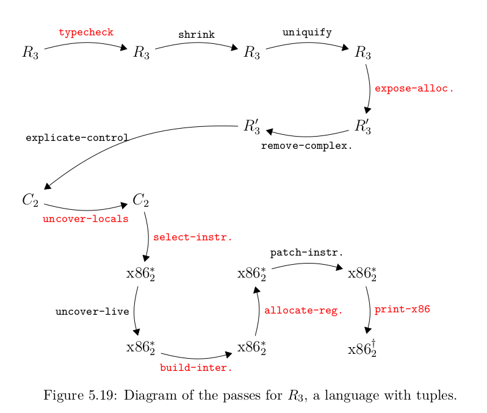

# Rust One Piece | R3（三）

现在，我终于尝到 Rust 的苦头了。

但还是先看看 R3 的编译过程吧！不知不觉间已经有了 13 个 pass 了。




这一节我想讨论的是 explicate-control 之前的 pass。

### 1. typecheck & shrink & uniquify

R3 在做类型检查的同时，也把每个表达式都用 `Hastype` 包装起来，`Hastype`的格式为

```rs
// syntax.rs
Hastype(Box<Expr>, RType)
```

嗯，这简直是一场灾难。我几乎要改动所有之前写的代码，因为它是位于第一个 pass！然而，实际上我把它放在第二个 pass，第一个 pass 是 uniquify。这样 uniquify 就不需要处理 `Hastype` 了，可以少改一些代码。

由于用了 `box pattern`，当括号一多，就很难分辨哪对哪，尽管有 `vscode` 的提示依然捉襟见肘。

`shrink` 和 `uniquify` 的改动不大，只是增加一些新的类型和操作，如 `Vector`、`Prim3` 等。

### 2. expose-allocation

这个 pass 负责给 vector 类型分配内存，垃圾回收也可能在这里被触发。它把下式
```lisp
(has-type (vector e0 . . . en−1 ) type)
```
转换成下式
```lisp
(let ([x0 e0 ]) ... (let ([xn−1 en−1 ])
(let ([_ (if (< (+ (global-value free_ptr) bytes)
                (global-value fromspace_end))
            (void)
            (collect bytes))])
(let ([v (allocate len type)])
(let ([_ (vector-set! v0 x0 )]) ...
(let ([_ (vector-set! vn−1 xn−1 )])
    v) ... )))) ...)
```

这还是省略了 `Hastype` 的简写，实际上比这个要难看得多。

由于这里创建了很多 `let` 语句，因此可以先把 `let` 语句的变量与值用一个元组存起来，就像这样

```rs
pairs = vec![
    (x0, e0),
    ...
    (xn_1, en_1),
    (void, if_form),
    (v, allocate_form),
    ...
]
```

然后，我们知道最终是要返回一个向量的`v`的，因此，最后一个 `let` 的`body`部分就有了。一个 `let`创建完成之后，又可以作为上一个`let`的`body`，直到所有的 `let` 都已经创建完成。

也就是

```rs
let mut ret = v;
while let Some((x, v)) = pairs.pop() {
    let let_ = Let(Box::new(x), Box::new(v), Box::new(ret));
    ret = Hastype(Box::new(let_), RType::Vector);
}
// 结果保存在 ret 中
```

这里附上 expose-allocation 的核心处理逻辑。

```rs
    // match above
    PrimN(op, v) if op.as_str() == "vector" => {
        // vector element allocate
        let exprs = v.into_iter().map(|e| expose_allocation(e));
        let vars = (0..exprs.len()).map(|_i| Var(gensym()));
        // vector itself allocate
        let bytes = exprs.len() * 8 + 8;
        let compare = {
            let free_ptr = Hastype(Box::new(_GlobalValue("free_ptr".to_string())), RType::Integer);
            let new_bytes = Hastype(Box::new(Int(bytes as i64)), RType::Integer);
            let new_freeptr = Hastype(Box::new(Prim2("+".to_string(), Box::new(free_ptr), Box::new(new_bytes))), RType::Integer);
            let fromspace_end = Hastype(Box::new(_GlobalValue("fromspace_end".to_string())), RType::Integer);
            Hastype(Box::new(Prim2("<".to_string(), Box::new(new_freeptr), Box::new(fromspace_end))), RType::Boolean)
        };
        // if form
        let if_form = {
            let then = Hastype(Box::new(Expr::Void), RType::Void);
            let else_ = Hastype(Box::new(_Collect(bytes)), RType::Void);
            Hastype(Box::new(If(Box::new(compare), Box::new(then), Box::new(else_))), RType::Void)
        };
        // allocate form 
        let allocate_form = Hastype(Box::new(_Allocate(exprs.len(), RType::Vector)), RType::Vector);
        // vector element assignment
        let vector_allocate = {
            let v = Var(gensym());  
            let void = Var("_".to_string());
            let mut pairs: Vec<(Expr, Expr)> = vars.clone().zip(exprs).collect();
            pairs.push( (void.clone(), if_form) );
            pairs.push( (v.clone(), allocate_form) );

            for (i, var) in vars.into_iter().enumerate() {
                let vset = {
                    let index = Hastype(Box::new(Int(i as i64)), RType::Integer);
                    let vset = Prim3("vector-set!".to_string(), Box::new(v.clone()), Box::new(index), Box::new(var));
                    Hastype(Box::new(vset), RType::Void)
                };
                pairs.push( (void.clone(), vset) );
            }
            // finally, using let to wrap every tuple and return v
            let mut ret = v;
            while let Some((x, v)) = pairs.pop() {
                let let_ = Let(Box::new(x), Box::new(v), Box::new(ret));
                ret = Hastype(Box::new(let_), RType::Vector);
            }
            ret
        };
        return vector_allocate;
    }
```


### 3. remove-complex-opera

值得一说的是，现在的复杂操作有这么多

```rs
// compiler.rs
fn is_complex_helper(expr: &Expr) -> bool {
    let any_if = If(Box::new(Int(1)), Box::new(Int(1)), Box::new(Int(1))); 
    let any_let = Let(Box::new(Var(String::new())), Box::new(Int(1)), Box::new(Int(1)));
    let any_prim0 = Prim0(String::new());
    let any_prim1 = Prim1(String::new(), Box::new(Int(1)));
    let any_prim2 = Prim2(String::new(), Box::new(Int(1)), Box::new(Int(1)));
    let any_prim3 = Prim3(String::new(), Box::new(Int(1)), Box::new(Int(1)), Box::new(Int(1)));
    let any_primN = PrimN(String::new(), Vec::new());
    let collect = _Collect(0);
    let allocate = _Allocate(0, RType::Vector);
    let global_value = _GlobalValue(String::new());
    mem::discriminant(expr) == mem::discriminant(&any_if)    ||
    mem::discriminant(expr) == mem::discriminant(&any_let)   ||
    mem::discriminant(expr) == mem::discriminant(&any_prim0) ||
    mem::discriminant(expr) == mem::discriminant(&any_prim1) ||
    mem::discriminant(expr) == mem::discriminant(&any_prim2) ||
    mem::discriminant(expr) == mem::discriminant(&any_prim3) ||
    mem::discriminant(expr) == mem::discriminant(&any_primN) ||
    mem::discriminant(expr) == mem::discriminant(&collect)   ||
    mem::discriminant(expr) == mem::discriminant(&allocate)  ||
    mem::discriminant(expr) == mem::discriminant(&global_value) 
}
```

### 4. 测试

由于`Hastype`，有很多测试是失败的。我将一边写一边修。

```rs
failures:
    test::test_allocate_registers
    test::test_explicate_control2
    test::test_optimize_jump
    test::test_patch_instructions
    test::test_select_instruction
    test::test_uncover_live
    test::test_uncover_live2

test result: FAILED. 34 passed; 7 failed; 0 ignored; 0 measured; 0 filtered out
```

### 5. 结语

Rust 的工具虽然好用，但有时候也很难用，尤其是那一层又一层的括号，跟 Lisp 有得一比了。也许是因为我对 Rust 并不了解，所以采用了许多复杂的方式吧？读者若有更简洁的写法，愿能不吝赐教。

```rs
compiler.rs         : 933
helper.rs           : 76
main.rs             : 134
parser.rs           : 116
syntax.rs           : 131
test.rs             : 502
tsort.rs            : 52
typesystem.rs       : 104
----------------------------
total               : 2048
```
